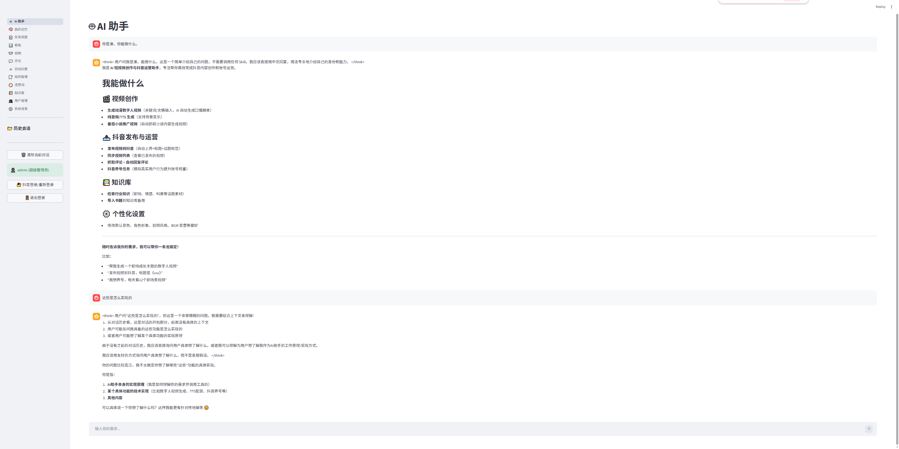
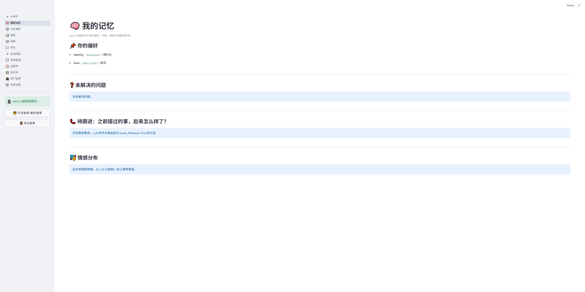
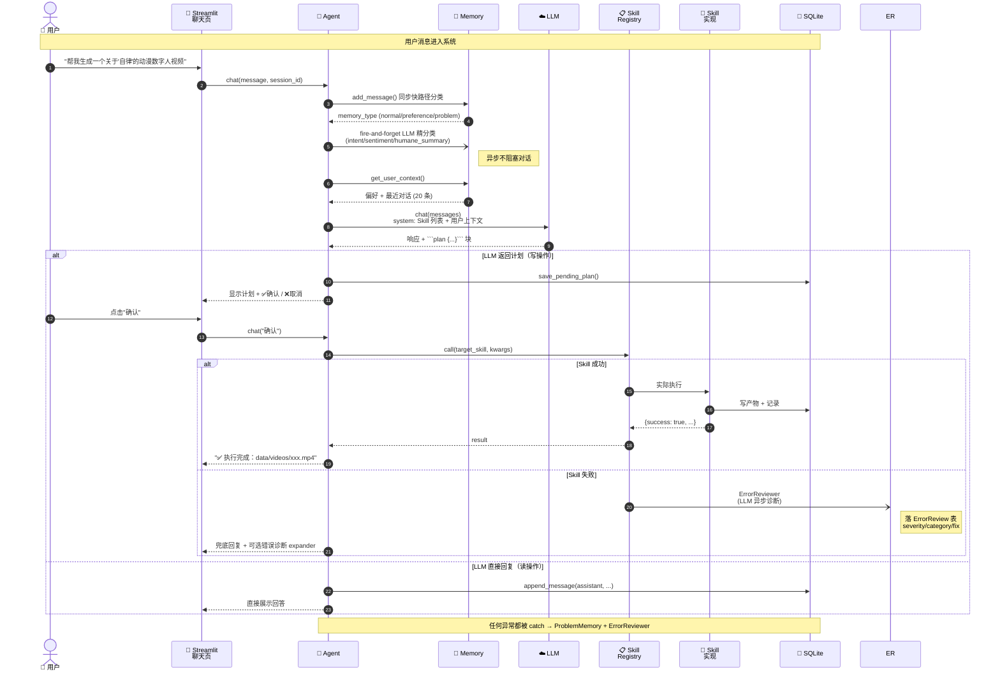
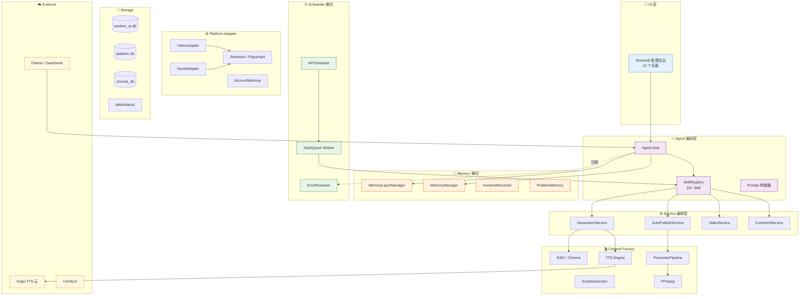

# AI ShortVideo

> 本地运行的 AI 短视频内容生成与多平台运营自动化工具。从自然语言一句话调度全链路：脚本生成 → TTS 配音 → 视频合成 → 视频平台发布 → 评论回复 → 定时任务。

[](LICENSE)
[](https://www.python.org/)
[](https://streamlit.io/)

[能力总览](docs/CURRENT_CAPABILITIES.md) ·
[用户指南](docs/USER_GUIDE.md) ·
[架构](docs/SYSTEM_ARCHITECTURE.md) ·
[简历介绍](docs/RESUME.md)

---

## 🎬 展示

<p align="center">
  
  
</p>

> 左：Agent 一句话调度全链路，**写操作必须用户确认后才执行**。  
> 右：分层记忆系统——LLM 异步分类（intent / sentiment / humane_summary），自动跟踪未解决问题。

---

## 这是什么

把短视频运营里的重复步骤交给 AI：

- **写脚本** — 关键词 / 文章 / 古典典籍 → LLM 生成 60-90 秒逐字稿
- **配音** — Edge-TTS（默认）或 GPT-SoVITS（声线克隆）
- **合成视频** — Edge-TTS + Sonic 角色视频层 + ComfyUI 动漫背景 + FFmpeg
- **发平台** — Selenium 浏览器自动化登录、上传、填标题标签、发布
- **运营** — 同步视频、抓评论、规则 + LLM 自动回复
- **调度** — cron + SQLite 任务队列 + 后台 Worker
- **对话** — Streamlit 聊天页一句话调度任意能力（带"先确认再执行"安全拦截）

完整能力见 [docs/CURRENT_CAPABILITIES.md](docs/CURRENT_CAPABILITIES.md)。

## 🔄 端到端工作流



完整工作流见 [docs/diagrams/workflow.md](docs/diagrams/workflow.md)。

## 🏗️ 系统架构

四层架构 + 横切关注点（Memory / Scheduler / LLM）：



完整架构见 [docs/diagrams/architecture.md](docs/diagrams/architecture.md) 和 [docs/SYSTEM_ARCHITECTURE.md](docs/SYSTEM_ARCHITECTURE.md)。

## 技术栈

| 层 | 技术 |
|---|---|
| 语言 | Python 3.11+ |
| UI | Streamlit |
| LLM | OpenAI-compatible / Ollama / 本地 |
| TTS | Edge-TTS / GPT-SoVITS |
| 视频 | MoviePy / FFmpeg / ComfyUI (SDXL) |
| 浏览器 | Selenium / Playwright |
| 存储 | SQLite (业务) + SQLAlchemy (Agent/记忆/调度) + Chroma (向量) |
| 迁移 | Alembic |
| 调度 | APScheduler + 自研队列 |

## 快速开始

### 环境要求

- Windows 10/11 或 macOS / Linux
- Python 3.11+
- 8 GB 内存（推荐 16 GB）
- NVIDIA 显卡（本地 AI 加速，可选）

### 安装

```bash
git clone https://github.com/chahax/ai_douyin.git
cd ai_douyin
pip install -r requirements.txt
cp .env.example .env
```

编辑 `.env`，至少填一项 LLM 配置：

```env
# Ollama 本地（推荐）
LLM_PROVIDER=ollama
OLLAMA_BASE_URL=http://127.0.0.1:11434
OLLAMA_MODEL=qwen2.5:7b

# 或 DeepSeek / OpenAI 兼容
# LLM_PROVIDER=openai_compatible
# LLM_API_KEY=sk-xxx
# LLM_BASE_URL=https://api.deepseek.com/v1
# LLM_MODEL=deepseek-chat

# GPT-SoVITS（可选，声线克隆）
# GPT_SOVITS_SDK_ROOT=./GPT_SoVITS
# GPT_SOVITS_CONDA_PYTHON=C:/Users/<your-user>/.conda/envs/GPTSoVits/python.exe
```

### 数据库迁移

```bash
# 全新环境
alembic upgrade head

# 已有 DB（保留旧数据，只追新迁移）
alembic stamp head
alembic upgrade head
```

### 首次启动

```bash
# 1. 导入知识库（可选）
python main.py import-knowledge --books-dir data/books

# 2. 先生成一段音频或数字人视频做本地验证
python main.py quick --keywords "人生哲学导向"
python main.py presenter --keywords "人生哲学导向" --tts-provider edge --max-segments 16

# 3. 首次发布到视频平台前，先登录
python main.py douyin-login

# 4. 启动管理后台
streamlit run src/web/app.py
```

访问 **http://localhost:8501** 即可使用管理后台。

### 聊天页（Agent）

打开"AI 助手"页直接对话：

- "帮我生成一个关于'自律'的动漫数字人视频"
- "把所有视频的评论自动回一遍"
- "把默认 TTS 换成 GPT-SoVITS"

涉及写操作（发布 / 生成视频 / 自动回复等）的 Skill 会先出计划，你回复"确认"才执行。

### Docker 部署（推荐）

```bash
cp .env.example .env       # 编辑 LLM_API_KEY 等
docker compose up -d       # 构建并后台启动
docker compose logs -f app # 看启动日志
```

打开 http://localhost:8501。

详见 [docs/DOCKER.md](docs/DOCKER.md)。

## 项目结构

```text
ai_douyin/
├── main.py                      # CLI 入口
├── src/
│   ├── agent/                   # 对话式 Agent（Skill Registry + 计划 + 确认拦截）
│   │   ├── agent.py             # Agent.chat() 核心
│   │   ├── registry.py          # 18+ Skill 注册
│   │   └── skill_decorator.py   # @skill 装饰器 + SkillParam schema
│   ├── memory/                  # 分层记忆（用户画像 / 会话 / 偏好 / 问题跟踪）
│   ├── scheduler/               # APScheduler + SQLite 任务队列 + 后台 Worker
│   ├── web/                     # Streamlit 管理后台（对话 / 调度 / 视频 / 评论 / 记忆）
│   ├── platform_adapter/        # 视频平台 + 网络文学平台 + 浏览器会话
│   ├── content_factory/         # 脚本 / TTS / 视频合成 / Presenter 管线
│   ├── rag_engine/              # Chroma 向量库 + Embedding
│   ├── services/                # 业务服务编排
│   └── shared/                  # 配置 / 日志 / DB / LLM Provider / Alembic 检测
├── alembic/                     # 数据库迁移
├── docs/                        # 文档（架构 / 用户指南 / 简历介绍 等）
├── data/                        # 数据目录（gitignored — 用户自备）
│   ├── chroma_db/               # 向量库
│   ├── books/                   # 导入的书籍
│   ├── videos/                  # 生成的视频
│   └── *.db                     # SQLite
└── scripts/                     # 工具脚本
```

## 能力速览

| 模块 | 状态 | 说明 |
|---|---|---|
| 动漫数字人主讲视频 | 当前主线 | Edge-TTS + Sonic + ComfyUI 按需背景 + FFmpeg |
| 单人口播模板视频 | 历史/兜底 | 模板视频循环 + 音轨替换 |
| RAG 知识检索 | 可用 | Chroma + Ollama embedding |
| 视频平台发布 / 同步 / 评论 | 可用 | Selenium 浏览器自动化 |
| 评论自动回复 | 可用 | 规则 + LLM + 安全过滤 |
| 多账号养号 | 测试版 | 多 profile、随机观看、可控点赞 |
| 网络文学平台推广 MVP | MVP | 网文达人中心 + Presenter 视频 |
| 对话式 Agent | 可用 | 18+ Skill，"先确认再执行" |
| 分层记忆 + 问题跟踪 | 可用 | preference / problem / 普通自动分类 |
| 任务调度 + 队列 | 可用 | cron + SQLite SKIP LOCKED |
| LLM 错误诊断 | 可用 | 严重度 / 类别 / 修复建议自动分类 |

详细能力边界与限制见 [docs/CURRENT_CAPABILITIES.md](docs/CURRENT_CAPABILITIES.md)。

## 文档索引

| 想了解什么 | 看哪里 |
|---|---|
| 项目是什么、解决什么问题 | [docs/PROJECT_INTRO.md](docs/PROJECT_INTRO.md) |
| 当前能做什么 / 还没做 | [docs/CURRENT_CAPABILITIES.md](docs/CURRENT_CAPABILITIES.md) |
| 怎么跑命令 / 用后台 | [docs/USER_GUIDE.md](docs/USER_GUIDE.md) |
| 整体架构 / 模块关系 | [docs/SYSTEM_ARCHITECTURE.md](docs/SYSTEM_ARCHITECTURE.md) |
| 阶段状态 / 下一步 | [docs/DEVELOPMENT_PROGRESS.md](docs/DEVELOPMENT_PROGRESS.md) |
| 简历项目介绍（可复制粘贴） | [docs/RESUME.md](docs/RESUME.md) |

## ⚠️ 免责声明

**本项目仅供技术研究与个人学习使用。**

- **视频平台 / 网络文学平台的自动化行为可能违反其用户服务协议和社区自律公约**。请在合规和合理使用的范围内运行本项目。
- **大量注册账号、群控、刷量、发广告**等行为违反主流平台规则，本项目**不鼓励也不支持**任何此类用途。
- 用户对自己使用本项目产生的任何后果（包括但不限于账号封禁、法律纠纷）**负全部责任**。
- 项目作者不为任何因使用本项目而导致的直接或间接损失负责。

## 贡献

欢迎提 Issue 和 PR。请先阅读 [docs/DEVELOPMENT_PROGRESS.md](docs/DEVELOPMENT_PROGRESS.md) 了解当前进度和方向。

## License

[MIT](LICENSE) — Copyright (c) 2026 chahax