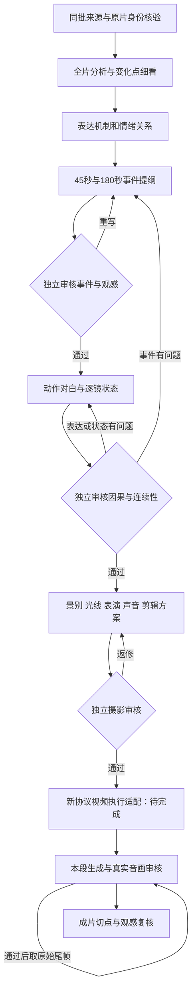

# 叙事冲击工作流 v1

2026-09-12 更新，北京时间（UTC+8）。本版已经提供可运行的命令行入口、提示词、来源核验、三阶段生成及审核拦截。本轮准备记录见 [workflow.json](../data/pre_video_scripts/_runs/narrative_impact_workflow_20260912/workflow.json)，目前处于 **ready_for_outline_authoring**，尚未调用编剧或生成视频。

新稿从 `scripts/run_narrative_workflow.py` 进入。网页和旧合同视频入口尚未自动切换到此协议；新协议的多场景摄影计划也尚未接入付费视频执行器。不能把这次代码交付说成新版成片已经生成，或将新稿未经适配塞回旧六镜模板。

## 这次改变的依据

重新细看 [40426344181-1-192 的逐时段报告](../data/qa/reference_404263_impact_audit_20260912/close_review_v2.md)：全长104.304秒，实际查看18张时间线接触表，采样间隔0.5秒，结合全轨本地转写及分窗音频/音画材料。分析保留小模型误读和听审范围；没有宣称精确口型已核对、受众反应已测量或平台指标已确认。

| 参考时段 | 可见机制 | 对新流程的要求 |
| --- | --- | --- |
| 20—30.5秒 | 前景示弱，背景吃东西、躺靠 | 分开记录人物表演、观众掌握的信息及预期感受；背景也能推进故事 |
| 39.5—45.5秒 | 倒数，交叉呈现转账，再出现到账结果 | 写清预期如何建立和兑现，不能归纳成“语速紧张” |
| 50.5—58秒 | 醒来、道具、摆姿态、拍摄、发布 | 把关键过程拍出来，不能只在结局摘要里宣布做完 |
| 77.5—85秒 | 求助与享乐碰撞；白天泳池动作切到夜湖 | 用可见代价和有意义的剪辑转折；不把暗示升级为确定身份、死亡或动机 |
| 93.5—103.5秒 | 看新闻愤怒，接电话后微笑 | 主要事件闭合后允许行为回扣与讽刺，不强迫平静和解 |

所以“人物很生气”不是唯一目标。新稿先检查事件、信息与后果，再设计语速、语气、表情和声音。没有新信息或新后果时，优先重写事件，不能只增加怒气形容词。

## 实际流程



图中的来源细看与独立审核由实际操作者执行，程序不会自动填“通过”。视频适配是明确的待完成环节；当前入口只执行准备和三个文本阶段。

### 1. 来源证据与全片观察

继续核验同一批次至少20条视频、至少2个不同主要标签，确认点赞总和或播放总和之一不低于100万。点赞不混称播放，不把两项混加。逐条核对原片、分析身份、实际文件哈希与对应独立审核，不能以标题概括替代原片分析。

本轮重验结果：20条，3个主要标签，确认点赞合计1,397,314；记录在 [source_gate.json](../data/pre_video_scripts/_runs/narrative_impact_workflow_20260912/source_gate.json)。指定本地参考独立进入 [reference_blueprint_v1.json](../data/qa/reference_404263_impact_audit_20260912/reference_blueprint_v1.json)，没有平台指标，不参与凑数量或点赞门槛，也不编造参考百分比。

`prepare_source_emotion_analysis.py` 新默认采用 `--sampling-mode full --window-seconds 12`，连续覆盖完整音轨，每窗保留原片起止秒数、独立文件和SHA。预览从原片单次转码，不把拼接窗口产生的边界当成原片剪辑。`--sampling-mode legacy` 才使用旧首中尾模式，并显式标记抽样与人工拼接范围。新全片观察发布后仍为 `model_observed_unverified`；完整覆盖不能自动证明模型判断准确。

细看时对信息、动作、表情、声音变化点及前后关系加密取证，分别写出画面事实、音频依据、编辑推断和未知项。双层情绪分析记录“角色此刻如何表现”和“观众因知道哪些事实可能产生什么感受”；后者始终是设计假说。**本轮没有把原20条素材全部重新跑成新全片情绪分析**，其已有证据继续保留原来的审核范围。

### 2. 事件提纲：outline

项目配置的文本模型输出共同核心、人物目标及利害、准确来源引用、短长两版事件链。每个事件必须有可见行动、新信息、后果、人物表现、观众预期及表达机制；每版分别合计45/180秒。

实际读稿检查开场为什么值得继续、信息如何变化、行动是否造成后果、结果如何兑现、结尾为何留下感受。可以先遮住对白设想故事是否仍发生了变化。结构有效不等于这些问题已有好答案。

不再预设合同金额出错、固定两人、六句轮流问答、单一机位，也不硬套某个冲突百分比或每几秒必须切镜。长版要有新增尝试、事件和后果，不能拉慢短版。

### 3. 动作对白与状态：script

只展开已经审过的事件骨架，程序逐字段锁定骨架、事件顺序和时长。镜头记录动作及实际结果、入画人物、场景、道具、起止状态，以及每句对白的镜内时间和语气语速设计。

同场相邻镜头的终态与下一镜初态须相等；换场或跳时需交代关系。无对白信息镜头、人物反应和1秒特写可以成立。现场对白说话人必须入画、时间不重叠且在镜内；不写旁白或内心解说。对白长度的结构限制不是语速合格证明。

独立审核要核对“说了要做”与“实际做完”的区别，逐步核对道具与证据链，确认人物何时获得信息、为什么改变决定，以及结尾是否兑现。不得靠摄影阶段偷偷增加新合同、道具或关键过程；事件缺失就回提纲修订。

### 4. 摄影与声音：production

故事、对白和时长冻结后，逐镜补景别、机位运动、信息焦点、光线、表演强度、声音计划、切镜理由和执行要求。每个已审镜头恰好出现一次，不允许摄影模型重写剧情字段。

摄影文字仍要实际审核是否暗中改变动作或加入额外台词。静默可以用于信息与反应，不能无事发生；高潮与收场不要求统一情绪。分别评估摄影是否准确执行故事、是否让信息和后果更容易感到。

连续动作标记 `raw_tail_continuation`；需要新适配的特写、机位或场景切换明确标记 `planned_cut_requires_adapter`。换场不能假装原尾帧会自动生成正确的新地点。当前每份新摄影方案的 `media_handoff.json` 均标记 `blocked_until_reviewed_execution_adapter`，`automatic_submit=false`。

### 5. 视频执行与成片验收

这一部分保留为下一项实施工作。适配器须显式区分“剪辑镜头”与“API生成单元”，说明如何执行特写、换场和连续镜头，再经过实际审核。不得静默转成旧稿schema来绕过要求。

具备受支持且已审的执行方案后，按 [视频制作流程](SCRIPT_VIDEO_RUN.md) 推进：本段生成、真实抽帧和音画审核，通过后原始尾帧才可作为下一段首帧。不合格先修对应上游，再重生成当前段；抽帧材料导出不等于审核通过。各新剧本通过项目登记入口独立从0累计，默认10次失败上限，旧稿与回执保留。

成片有两份结论：连续性、声画、字幕和因果是否正确；信息、代价、节奏、转折及结尾是否有力量。前一项通过不能自动代表后一项通过。

## 运行与审核

本轮已经准备的工作流可只读核验：

```powershell
.venv\Scripts\python.exe scripts/run_narrative_workflow.py check --workflow data/pre_video_scripts/_runs/narrative_impact_workflow_20260912/workflow.json
```

新准备使用 `prepare --workflow-request <原批次request.json> --reference <已审参考蓝图> --brief-file <本轮任务.md> --output-dir <data下新目录>`。会重新核对全部来源，保存输入身份、上下文、来源门槛和北京时间；不调用模型。输入更改后须准备新工作流，不能覆盖历史冻结文件。

后续明确运行编剧时执行下面命令；**这会调用已配置的付费文本模型，本轮尚未执行**：

```powershell
.venv\Scripts\python.exe scripts/run_narrative_workflow.py author --stage outline --workflow data/pre_video_scripts/_runs/narrative_impact_workflow_20260912/workflow.json --output-dir data/pre_video_scripts/_runs/narrative_outline_20260912_v1
```

输出原始请求、提示词、模型原文、响应元数据、候选及待填写的 `review.template.json`。操作者实际检查后另存审核记录，逐项给出候选位置和判断依据。不得批量把空模板改成通过。程序要求候选及工作流SHA匹配、全部检查已完成、无未解决项且审核时间为UTC+8。

下列是参数示意，尖括号须替换为真实工件：

```powershell
.venv\Scripts\python.exe scripts/run_narrative_workflow.py author --stage script --workflow <workflow.json> --parent-run <已审outline目录> --review <该提纲的实际审核.json> --output-dir <data下新script目录>
.venv\Scripts\python.exe scripts/run_narrative_workflow.py author --stage production --workflow <workflow.json> --parent-run <已审script目录> --review <该剧本的实际审核.json> --output-dir <data下新production目录>
```

返修使用同阶段新目录及 `--feedback-file <具体返修意见.md>`，由模型重新产出，不手改候选冒充模型原文。返修意见必须带上需修改的具体内容与定位；当前没有自动读入同阶段旧稿的修订参数。修改提纲后必须重新审稿、重新展开下游，不能套用旧父稿的审核。

父链复验原始模型输入与父稿、反馈、上下文一致；候选必须与归档模型输出一致。同一输入的模型调用预留记录阻止换目录重复提交；调用失败或回执不明时先查实际回执，不删除预留记录重试，也不靠加无意义反馈绕过。所有时间为记录中的真实阶段时间，不能从文件修改时间推断完成时间。

首次实跑后补充：编剧输入现在使用 `source_digest_v2`，保留全部20条来源的核心、表达分析、已知限制和指标；逐帧证据只发送语义主张及各音画通道的首末证据行，所有发送行保留原文。完整原片、全量证据与独立审核仍在每次调用前核验；投影数量和方法显式记录，不能把未发送的行当作本次编剧已读证据。原始全量请求仍按旧版本重放验证，历史失败不覆盖。引用同时受实际发送证据范围限制。

`author --thinking adaptive` 可仅为本次MiniMax-M3调用启用推理，`--thinking disabled`关闭；省略沿用项目设置。选择写入run记录，不改`.env`默认配置。不要用推理模式取代真实编辑审核。全部文本及摄影审核完成后，`scripts/render_narrative_candidate.py`可以按原始候选机械排版导出短、长阅读稿，校验三层父稿和最终摄影审核后才写入新目录；不改写对白，不生成视频。

当前作者输入已进一步升级为 `source_digest_v4`：保留全批概览，当前同批点赞案例中详细展开两条人物冲突、两条实物演示参考，指定本地视频作为本轮主要风格参考；其他案例保留完整核心概括、类型、限制与核心证据首末行。`expression_analysis`各处的`evidence_ids`同时裁剪到实际发送证据范围，避免摘要仍挂着未发送的编号诱发误引。原始全量及v2/v3请求按各自版本重放验证，不能用当前投影重新解释旧请求。观察、借鉴选择与效果假说仍分开，不据这些选择推断点赞因果。

聚焦指定参考或修订已返回原稿时，可显式选 `--source-projection source_overview_v5`：全20条仍逐条本地验证并保留核心概览及审核范围，但只作账号/样本背景，不允许在reference_usage直接引用其未发送的证据。直接表达引用限于已审指定参考的insights。该选择写入实际请求和run，不暗中缩小样本门槛。定点返修必须把**完整原稿或足够的原文片段**连同原始SHA和具体问题一起写入反馈文件；只发送问题列表容易使模型另起一稿，不能称为忠实修订。

## 本轮验证与边界

- 三阶段及来源身份回归：50项通过，覆盖假引用、错误父稿、篡改上下文、未审/漏审、状态断裂、时长与对白异常；也确认信息插镜与无对白结尾可用。
- 全片分窗与发布回归：26项通过；13.2秒合成媒体的FFmpeg烟测确认完整覆盖及音视频轨，未请求付费模型。
- 真实20条来源准备成功，模型调用0、媒体调用0，参考蓝图包含13项事件分析、38份绑定证据文件。
- 尚未执行新编剧候选、观感实测或新视频；网页路由和新协议视频适配尚未接入。


### 2026-09-12：已审提纲分版展开

双版一次展开可能耗尽输出额度。现在 `author --stage script --kind short` 和 `--kind long` 可分别展开同一个已审提纲；冻结故事的展开步骤可用 `--thinking disabled`，不改变项目默认模型配置。仍逐版校验原事件、时长、道具状态和对白时间。

两版成功后使用 `assemble-script --workflow <workflow.json> --short-run <short目录> --long-run <long目录> --output-dir <新目录>`。合并不调用模型、不修改台词，绑定两份原始模型回执及相同提纲审核；合并后必须实际审核双稿，才可进入 production。仅一版成功不能冒充双稿完成。

重试修复必须提供上一轮完整实际输出及具体问题；不能只发问题清单让模型另起故事。失败、截断和超时回执保留，不能标为通过或计入视频失败次数。


### 状态增量传输（script delta_v1）

`author --stage script --kind short|long --script-format delta_v1` 让模型输出完整初始实体状态及逐镜 `changes`，不再重复整张状态表或抄写已审事件。程序 `expand_script_delta` 只执行深拷贝和已知实体键更新：事件原样来自已审提纲；未变化实体继承前镜；动作、对白、镜时长不改写。原始增量JSON与展开后的candidate分别留档，读取时重新展开比对，拒绝伪造或改写。

这只能防止重复抄写漂移，不能自动证明动作与状态正确：模型若写了错误变化、漏写拿放动作、给错误时长，仍由结构检查与实际内容审核退回。不能将继承状态表视为已经完成观感或声画检查。


### 已审故事展开输入收敛

`--source-projection frozen_parent_v6` 仅允许 script/production：全20条源文件与提纲来源审核继续本地核验；向模型只发送已审父稿、账号约束和具体修改意见，不重复发送原始素材或声称再次分析。这一步不能新增参考结论。`--model MiniMax-M2.7` 是单次运行覆盖，回执记录实际模型，项目默认配置不变；M3专用thinking字段不会传给M2.7。


### 可读剧本审阅（执行编译前）

为避免状态表格式负担掩盖故事质量，新增 `scripts/author_narrative_readable.py`：绑定同一经过实际审核的outline，按short/long分别由真实项目文本模型生成完整动作、对白、情绪、机位光线审阅稿。逐版有原请求、模型、原正文、SHA、北京时间和token回执。不是助手手写替代，不把旧结构化失败改标通过。

此入口状态为 `editorial_candidate_pending_actual_review`，必须实际检查时间、因果、拿放、声画计划和收场，再单独留下绑定正文的编辑审核记录。它不会转换为执行schema，不允许视频交接；用户认可后仍需状态编译、执行适配及逐段实际声画审核。文本审核只能证明审阅稿内容检查，不能证明生成画面或观众效果。


### 局部编辑修复与完整追溯

`scripts/revise_narrative_readable.py` 对实际模型可读稿执行模型返回的精确 before/after 替换。每个before必须唯一匹配，拒绝缺失/歧义/空替换；未涉及段落原样保留。回执绑定原稿run、反馈、原始模型替换JSON、应用结果与真实北京时间。`verify_editorial`递归重放所有模型替换，拒绝自行改稿后重算哈希伪装模型输出。局部替换仍可能写错内容，必须再次实际审读；其状态不自动通过，更不能放行视频。
