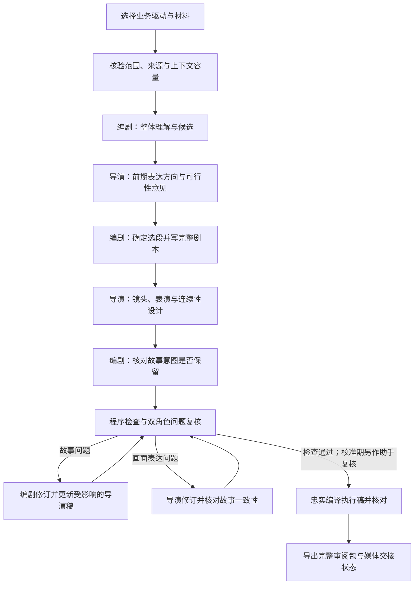

# 小说与视频双驱动剧本流程改造方案

版本：v1.6｜日期：2026-09-25｜状态：**双角色文本流程已完成三类连续首稿校准；不设置常驻第三审核模型**

实施进度、实际模型回执、失败记录与剩余验收以 [CREATIVE_WORKFLOW_IMPLEMENTATION.md](CREATIVE_WORKFLOW_IMPLEMENTATION.md) 为准。下文“本轮只提交完整方案”和“待录入 Token”等文字是批准前的方案原文，不应被当作当前实施状态。

本版补充：按用户意见，编剧 Agent 确认为 MiniMax M3，导演 Agent 确认为 DeepSeek-V4.1-Flash；不设置常驻第三审核模型，也不为尚不存在的合适审核模型保留 Token 或配置槽。前期助手校准已在同一工作流指纹下由 `other_genre_novel`、`campus_novel`、`video_original` 三类独立任务连续首份完整稿 3/3 通过，`stop_per_draft_assistant_review` 已切换为 `true`。程序检查、编剧与导演交叉核对及视频实际审核继续保留；供应商、型号、输入形式、画风类别变化或质量回退时临时恢复针对性助手复核，问题关闭后再次退出。两个业务驱动均使用这组创作角色；当前实现与真实试跑结果见 `CREATIVE_WORKFLOW_IMPLEMENTATION.md`。文本校准完成不代表媒体执行验收或三次完整视频流程通过。

最终工程验证已覆盖完整收集的 3019 项测试：2949 通过、70 项因既有历史外部证据缺失而跳过、0 失败、0 错误；三个创作流程聚焦文件 280/280 通过，相关 Ruff 通过。可复核汇总见 `data/qa/creative_workflow_full_pytest_20260925.aggregate.json`。

本文件回应的问题是：为什么已经有小说正文和视频分析，产出的剧本仍然像填表，缺少整体理解、构图、表演和情绪设计；如何让自动化流程完成从理解材料到导演剧本的创作与审核。

本轮只提交完整方案。**确认本文件前，不修改正式流程、不切换默认入口、不安装框架、不调用文本或视频生成任务。** 文中“拟”“应”“将”均表示拟实施要求，不代表当前功能已经具备。此次确认也不等于确认现有剧本或视频合格。

## 1. 要达到的结果

用户选择“视频驱动”或“小说驱动”，提供或指定已有材料，系统自动完成：材料核验、整体理解、候选比较、创作方向、剧本、镜头与表演设计、双角色互核及程序检查、定向修改、可读稿与执行稿导出。前期再由助手对完整稿作阶段性复核。

用户可以查看每次选择的简明理由、引用证据、审核问题和修改结果，不必替流程逐镜补提示词。流程默认自主推进已授权的文本工作；方向存在实质冲突、材料不足或达到返修上限时，才报告具体待决问题。

改造重点有四项：

1. 让编剧阶段真正使用足够的上下文，并保留人物关系、前因后果和参考表达的细节。
2. 先决定观众应该看到什么、感受到什么，再设计对白、动作、构图和剪辑。
3. 让审核能指出“哪里不成立、为什么、改哪一层”，而非只检查字段齐全。
4. 两种业务流程独立可切换，复用公共编排能力；小说流程也能使用合适的视频表达参考。

本期交付止于经过审阅的剧本及明确的媒体交接状态。真实视频生成质量仍须在实际生成后逐段检验，不能由文本评分代替。

## 2. 现状诊断：已核实的问题与尚未排除的因素

| 位置 | 当前实际情况 | 对效果的影响 | 拟调整 |
| --- | --- | --- | --- |
| 小说高光分析 | 默认约 6000 字分块、1200 字重叠，按候选得分选段 | 容易把局部刺激强度当成整体改编价值，缺少跨章节比较与因果整合 | 先整体理解已获取材料，再比较高光；分块仅用于实际超限情况 |
| 小说拆镜 | 绑定高光后，编剧主要收到选中片段；本次片段约 1300 字 | 已有前文人物信息、题材气质和关系发展没有充分进入编剧决策 | 能容纳时保留完整材料和已确认决策，选段只标明主要取材范围 |
| 参考视频接入 | 旧入口主要接收特定 JSON 字段；已有 Markdown 分析不自动进入；小说模式对参考的利用有限 | 文件存在，却不等于模型读到了；复杂表达分析容易被缩成几个时间比例 | 建立明确的资料适配与实际输入清单 |
| 风格与镜头 | 当前后补导演层有固定人物、停车场、24 镜和题材到画风的固定映射 | 单稿能补细节，但换小说后可能仍套同一套镜头 | 使用由本次材料生成并审阅的导演方案，不把单稿内容当通用模板 |
| 时长与提示词 | 旧拆镜要求主要围绕短镜头和较短首尾帧描述 | 情绪窗口、动作过程可能被机械截断 | 先确定戏剧节奏，再映射到生成模型支持的片段 |
| 审核 | 有对白定位、事实检查、结构校验；导演层也有字段和状态校验 | 这些检查不能证明人物动机、构图和表演有效 | 增加独立的内容与导演审核，保留实际问题和修订证据 |
| 入口一致性 | 有的能力在独立脚本中，主入口没有完整串起 | 文档描述的流程与用户真正触发的流程可能不同 | 验收实际入口走完的阶段，不只验收函数和单独演示 |

需要纠正此前解释中的过度判断：

- **JSON 输出本身不会使模型失去推理能力。** 问题在于当前任务拆分、输入、输出约束与审核是否支持创作。可保留 JSON 作为交换格式，同时提供完整可读剧本。
- **目前不能排除模型能力、参数、输出额度等因素。** 本地代码足以证明若干流程缺陷，但不足以证明“模型完全没问题”。改造时记录实际模型和参数，再判断效果。
- **约 2.5 万字符不能直接等同于一定能放入某个模型。** 应核对实际模型窗口、token 估算、输出与推理预留。能放下时优先整体输入，不先机械切碎。
- **现有材料不是完整小说。** 当前书籍目录有 101 章，已恢复正文为 10 章。只能声称理解“已获取的 10 章”，不能声称读完后续。

## 3. 两个独立驱动，共用创作与审核能力

### 3.1 视频驱动：分析视频，创作新故事

主要来源是已获取的视频及其经过核验的分析。先理解观众信息差、刺激与反应、镜头安排、情绪峰值和收束，再围绕本次主题创作原创故事。

这一模式不要求提供小说，也不自动把小说人物和剧情混入。可借鉴表达机制，但不把参考片的人物、对白和具体剧情直接搬成新稿。参考分析中的未核实音画结论保持待核实，不当成确定事实。

### 3.2 小说驱动：理解小说，改编高光

主要来源是已获取的小说正文、书籍元数据和本次推广目标。正文决定人物、关系、事件与因果；高光选择、改编长度和情绪放大由故事本身决定。

参考视频是可选资料，用来帮助表达、镜头和节奏设计。没有参考片时，小说流程也可以运行；指定参考片但读取失败时，必须明确报告，不能静默当作已经使用。

### 3.3 切换规则

拟将以下两个配置分开：

| 配置 | 含义 | 规则 |
| --- | --- | --- |
| `source_driver` | `reference_video` 或 `novel`，决定故事从哪里来 | 每次运行明确显示并写入记录；不得自动切换 |
| `reference_pack` | 可选的画风、摄影、表演、节奏参考集合 | 小说模式可以使用；每条说明适用与不适用的部分 |

现有小说高光入口中的 `reference_video` 实际是“参考结构映射到小说”，与这里定义的独立视频驱动不同。迁移时保留其旧语义和历史记录，明确标为旧模式；不能只换名称，让同一旧参数突然执行不同业务。

界面与命令行应显示：驱动、材料范围、参考集合、风格约束、本次预计输出、当前审核状态。默认沿用账号选择，单次覆盖仅影响本次；历史任务继续使用原配置，不自动重跑。

### 3.4 两个创作 Agent：编剧与导演

拟设置两个具有独立任务说明、工作上下文和产物责任的创作角色。本项目按用户确定的分工配置：**编剧使用 MiniMax，导演使用 DeepSeek**。角色框架在技术上可以支持不同配置，但本次实施不得擅自改回同一模型包办两个角色。不同厂商也可能存在共同盲点，不能据此宣称质量已经改善。

| 角色 | 主要负责 | 交付内容 | 职责边界 |
| --- | --- | --- | --- |
| 编剧 Agent | 理解原文或视频的故事机制，比较高光，设计人物动机、冲突、事件、对白、情绪节奏与收束 | 故事理解、候选比较、完整可读剧本、每个情绪节点的意图与原文依据 | 决定故事为何发生、角色要什么、关键反应意味着什么；可以提出画面想法，不预先硬锁所有机位和构图 |
| 导演 Agent | 独立理解材料的气质与表达方式，评估候选可视化，选择画风，设计空间、镜头、调度、微表演、声音与连续性 | 导演方向、视觉设定、分镜与表演时间线、制作限制、给编剧的具体返修意见 | 决定观众如何看见和感受到剧本；能调整非冲突的制作细节，修改既定对白、人物关系、关键动作结果或事件顺序必须交编剧修订 |

两个角色共享同一版本的原始材料、用户要求、已确认设定和有效稿件。导演也要看到正文和参考证据；不能只收到编剧压缩后的几句梗概。每次调用以最新有效产物和未决问题为工作依据，不以不断累积的聊天记录代替版本状态。输入容量与实际发送范围仍遵循第 5 节，不能因为分成两个 Agent 又重新丢失上下文。

合作方式是有明确交付的阶段协作：

1. 编剧先提出故事理解与候选，说明情绪重心和取材依据。
2. 导演在完整剧本展开前参与一次，比较表达方向、画风和制作可行性，指出需要补足的可见动作或前因。
3. 编剧结合导演意见定稿故事与情绪结构，再写完整剧本。未采纳的实质意见需说明理由，不以默认同意处理。
4. 导演接收带版本的剧本，把意图转成构图、表演、镜头和声音计划。遇到无法靠摄影解决的动机或因果问题，提交返修单给编剧。
5. 编剧回看导演稿，核对是否改变人物、事实或情绪重点；画面表达问题由导演修，故事问题由编剧修。跨层改动按父稿关系更新，随后进入程序检查；前期校准序列另由助手复核。

每次交接至少包含材料版本、父稿版本、本次完整产物、必须保留的事实与情绪节点、可调整的制作项、未解决问题。返修单标明问题位置、依据、希望保留的意图和修改建议；接收方输出具体差异及处理结果，不能仅回复“已优化”。

交接接受只表示资料足以进入下一阶段。编剧不能以“已经写了悲伤”否定导演指出的表情不可见问题；两者的分歧按具体证据和职责处理，涉及用户锁定方向、关键来源缺口或预算耗尽时再报告待决问题。

例如关键质问是全段的情绪重心：编剧负责交代这句话为什么刺痛对方、双方此刻各自期待什么；导演负责安排说前的迟疑、说话时的视线、听者受到刺激的反应及其可见时长。导演发现动机不明，应退回编剧补足；不能靠在道歉后增加一串动作替代前面的情绪过程。

两者互相检查属于创作协作，**不能相互点头后直接标为“已由助手复核”或“视频通过”**。日常文本放行还要经过第 6 节阶段 E 的程序检查；前期校准任务需要实际的助手复核记录。不要求第三个创作 Agent，也不设置常驻第三审核模型。程序负责阶段调度、版本绑定、问题路由和预算控制，不另设一个自由改写剧本的“总控作者”。

两个驱动与两个角色是不同维度：用户选择视频或小说作为来源后，都由编剧和导演协作；不是视频只交导演、小说只交编剧。角色协商与返修共用第 10 节预算，不分别各开一套循环。

### 3.5 模型分工与当前配置差异

| 职责 | 已确定的分工 | 具体型号与实施状态 |
| --- | --- | --- |
| 编剧创作及故事返修 | MiniMax M3 | API `model_id` 为 `MiniMax-M3`；角色路由已接入新版文本试跑，并有真实响应回执 |
| 导演前期参与、分镜设计及视觉返修 | DeepSeek-V4.1-Flash | API `model_id` 为 `deepseek-flash`；角色路由已接入新版文本试跑，并有真实响应回执 |
| 阶段性文本复核 | 助手实际审阅，非第三模型 | 只用于前期校准连续独立任务；三类首份完整稿连续 3/3 无阻断或主要问题后自动退出逐稿复核；供应商、型号、画风、输入类型变化或质量回退时临时启动针对性复核，问题关闭后再次退出。无需确定、购买或配置第三个审核模型 |

以下是 2026-09-21 实施前对旧通用入口的只读快照，并非 2026-09-22 新版双角色入口的当前状态：

- 通用文本路由的主机为 `api.minimaxi.com`，`LLM_MODEL` 为 `Minimax-M2.7`。
- `SCRIPT_LLM_MODEL` 为 `MiniMax-M3`，`SCRIPT_REVIEW_LLM_MODEL` 为 `Minimax-M2.7`，`VIDEO_SCRIPT_MODEL` 为 `Minimax-M2.7`。
- 当前通用路由的 `LLM_PROVIDER=openai` 是兼容协议适配配置，不能据此把实际厂商写成 OpenAI。

该快照仅说明旧入口；新版试跑的 `state.json` 已分别记录 MiniMax `MiniMax-M3` 与 DeepSeek `deepseek-flash` 的请求和服务响应型号、用量及回执。前期助手实际审阅产物并留下绑定证据，不调用或配置第三审核模型；三类独立首稿连续无主要异常后取消逐稿额外复核，异常时再针对性复核。当前没有合适的第三审核模型不构成实施阻塞，也不保留待配置的第三 Token 槽位。程序与双角色相互核对始终保留。

角色非密钥配置见 [creative_agent_models.json](D:/IT/ai_douyin/config/creative_agent_models.json)，Token 由 [configure_creative_agent_tokens.ps1](D:/IT/ai_douyin/scripts/configure_creative_agent_tokens.ps1) 隐藏输入并仅写入被 Git 忽略的本地 `.env`。角色路由已接入新版试跑；质量与完整验收仍以实际任务证据为准。

实施时分别绑定编剧和导演的路由与 `model_id`，记录请求所用配置和服务返回的模型信息，核对是否符合本次角色分工。无需寻找第三个审核模型。不能只换角色提示词却让两个角色仍走同一通用客户端；也不能把 MiniMax 专用参数原样转发给 DeepSeek。某角色调用失败时保留进度并报告实际原因，不静默换厂商后继续宣称符合既定分工。密钥只在现有安全配置中使用，不写入剧本、交接包或审阅文档。

## 4. 材料进入流程前，要真正读到了什么

建立一份本次材料清单，至少包含：

- 小说：书籍标识、标题、正文文件、章节范围、缺失范围、来源时间、文件哈希；区分新获取内容、历史缓存和人工提供内容。
- 元数据：分类、标签、简介；保留其来源，不能把简介里的宣传语当作剧情事实。
- 视频参考：原视频与分析的对应关系、分析版本、实际观察范围、可定位的时间证据、尚未核实的声音或表演判断。
- 创作约束：用户偏好、账号定位、既有角色设定、目标时长范围、改编策略、已明确的禁止事项。

当前小说正文来自此前恢复的本地材料。它可以用于本次创作，但不能因此声称当前在线抓取已恢复正常。本期接入已有取材成果，不另行承诺解决失效页面和整书采集。

资料适配支持项目已有 JSON 和 Markdown 分析。转换后保留原始段落、时间或章节引用，并给出“读入几条、有效几条、排除几条及原因”。不能仅凭路径数量生成参考使用统计。

冲突处理优先级：用户本次明确要求 → 已确认的项目设定 → 小说正文事实 → 书籍元数据 → 可选参考。若用户要求会改变原著关键事实，应标明这是改编决定，不能改写原文证据。互相矛盾且无法判断的材料应列为待决问题。

## 5. 上下文策略：放得下就整体使用，超限才分层

### 5.1 本次材料能容纳时

整体理解、候选比较和剧本创作阶段，优先输入全部已获取正文、相关视频分析、用户约束和已确认创作决定。正文与参考分区标注，避免参考剧情污染小说事实。

同一阶段因资料过多而减少输入时，记录具体未发送的部分及原因；文件保存在磁盘上不等于模型已读。导演核对剧本、前期助手复核时都应看到完整候选和足够原始证据，不能仅凭编剧的摘要认可编剧。

### 5.2 容量核验

每次调用记录实际模型标识、上下文限制的依据、输入估算方法、输出预算、该提供方适用的推理预算及最终用量回执。不能把不同提供方的推理计费或上下文规则一概套用。

如果缺少准确 tokenizer，使用保守估算并明确“估算”；如果窗口或参数能力无法确认，先完成能力核验，不能以“模型很大”为依据发送后静默截断。正文、系统提示、阶段产物、修改反馈都纳入预算。

### 5.3 实际超限时

按章节或完整事件分段理解，生成带原文定位的人物关系表、事件时间线和候选表，再进行全局整合。编写选中场景时，重取选段、必要前因后果和相关人物证据；不能只拿摘要编造细节。

跨章动机不足、来源缺口影响判断时，标记范围限制。分层输入必须可追踪、可补读；不得把“分段都看过”自动视为已完成全局理解。

这是一种按实际容量选用的输入策略，不要求先建设向量数据库或引入新的开源框架。

## 6. 拟实施的完整生产链

图中的修订需要遵守父稿依赖：如果问题涉及选段或人物动机，应回到相应上游，重新生成和审核受影响的下游内容，不是只修改最后一层提示词。

### 阶段 A：整体理解

**责任：** 编剧主责故事理解；导演直接阅读同版材料，负责表达参考与题材视觉气质的判断。

**输入：** 核验后的材料与用户目标。

**输出：** 已获取范围的故事概览、人物关系与欲望、关键前因后果、情绪轨迹、题材气质，以及参考片可借鉴的表达机制。

对小说中的角色描述，记录“描述的是谁、在哪一章、处于什么情境”。对参考片记录“哪种镜头安排造成什么可观察效果”，不只记录峰值百分比。

**检查重点：** 不混人物、不预知缺失章节、不把小说修辞直接变成画面事实；能够用具体事件解释人物为什么反应。

### 阶段 B：候选与导演方向

**责任：** 编剧提出与确定故事候选，导演前期参与表达和制作评估；记录最终取舍，不将审美与故事选择拆成互不相干的决定。

通常提出 2—3 个实质不同的候选；材料只有一个完整事件时，说明限制，不凑候选。逐一比较：

| 比较项 | 应回答的问题 |
| --- | --- |
| 核心体验 | 观众看完主要感到什么，为什么会在意？ |
| 独立可理解性 | 需要补充哪些前因，陌生观众才能读懂？ |
| 冲突与反差 | 双方想要什么，哪里相撞，谁在何时取得主动？ |
| 情绪高光 | 具体哪句话、哪个决定或动作形成峰值？ |
| 可视化 | 哪些信息能通过表情、距离、动作、环境呈现？ |
| 时长与收束 | 内容足够支撑多长，结束时兑现什么、保留什么？ |
| 制作难度 | 是否依赖当前执行器不支持的换场、多人或复杂动作？ |

得分可辅助排序，但不得只选最高分。最终选择要说明取舍和未采用候选的主要问题。

同时生成导演方向：主要情绪、观众视角、角色关系、表演尺度、时长建议、视觉媒介、色彩与光线、空间组织、声音计划。画风未被用户锁定时，比较至少两个有差异的可行方向，再自主选择一个并给出理由。

### 阶段 C：完整可读剧本

**责任：** 编剧创作，接收导演已记录的前期意见。

先输出能连续阅读的戏：场景、动作、对白或已选定的旁白方式、节奏、人物反应、结尾。不能以一串标签和首尾帧描述充当完整剧本。

每个关键情绪段落必须说明：前置刺激 → 角色理解 → 可见反应 → 行动或回答 → 对关系的影响。重要对白的前、中、后均有明确表演安排，时间按实际信息与表演需要分配，不要求三段平均。

时长由内容容量、台词与反应窗口决定。45—180 秒可作为当前小说推广的建议区间，不能为凑时长重复动作；更长内容应说明新增戏剧内容，必要时按完整事件分集。时长尚不受执行器支持时，应标明限制，不偷偷裁短。

开头可以从高光预示进入，但需明确时间关系，避免把同一动作重复发生两遍。结尾应兑现本片承诺，再保留原著支持的后续悬念；推广引导作为独立文案，不擅自加入角色对白或虚构后续剧情。

### 阶段 D：镜头与表演设计

**责任：** 导演创作，编剧核对故事、事实与情绪意图是否保留。

在剧本基础上给每个镜头确定：

- **叙事目的：** 这一镜新增什么信息或关系变化；没有作用的镜头可删除。
- **画面焦点：** 观众先看到谁、看哪里；景别、角度、人物距离与环境如何服务焦点。
- **表演时序：** 谁先说、谁先动、听者何时变化；变化应能在选定画面内看见。
- **起止状态：** 站位、视线、持物、接触、姿态及未完成动作。
- **剪辑关系：** 为什么在这里切、切后观众视角怎样变化、是否需要交代空间。
- **声音计划：** 说话人、画内或画外、必要环境声与留白；这是计划，不是声画已通过。

光线、色彩、环境细节要建立空间和情绪。无需强制每镜写满前中后景、两个光源或一个精确焦段；这些字段齐全不等于构图有效。角色特写允许背景简化，道具出画不等于消失，但状态应持续。

“过肩看男主”的画面不能同时要求观众清晰读到背对镜头女主的泪光。若泪光是情绪重点，就调整机位、增加反应镜头或移到可见窗口。听者反应镜头可以承接画外对白，但必须标明说话人与声音位置，不能把没露嘴误判成无人说话。

人物档案锁定原著明确的年龄、外貌、关系等；未明确部分记录为制作选择。场景设定锁定可辨识的门、出口、光源、人物空间关系。不能用“延续上一镜”几个字替代可检查的状态。

### 阶段 E：程序检查、阶段性助手复核与定向修改

所有稿件都做程序检查：材料与父稿版本、来源引文归属、对白约束、事件和镜头映射、持物及站位状态、未解决问题、编译前后差异。编剧与导演分别对职责范围外的改动提出问题单，双方同意本身不能替代程序检查，也不等于真实画面通过。

前期校准由助手实际阅读全文、查看原始证据和分镜，重点复核人物归属、动机、情绪高光及可拍性，记录受审稿哈希、具体问题与修订结果。连续三个**不同创作任务的首份完整稿**均无阻断或主要质量问题，并覆盖第 12.3 节的不同来源/题材案例后，自动停止每稿额外助手复核；这不是长期常驻岗位。未达到条件时不宣称已稳定，也不为凑次数跳过失败稿；出现重大回归、输入来源或画风明显变化、角色模型变更时，再临时恢复针对性复核，问题关闭后退出。这里不需要第三个审核模型，也不把助手复核冒称真人用户抽检。

阶段性助手复核至少覆盖：来源归属、人物动机、事件因果、情绪重点、时长与台词容量、构图可读性、表演可执行性、连续性、参考使用合理性。取消逐稿助手复核后，这些属于双角色互核与程序检查的目标，其中主观观感不能声称已由独立第三方审过。

每个问题必须给出：所在段落或镜号、证据、影响、应修改的阶段、修复建议和复查结果。按阻断问题、主要质量问题、可选建议区分；阻断和主要问题不能由高总分抵消。若无法判断，保留待审，不能填“通过”。

返修输入包含实际上一版全文、已确认设定、问题清单和相关来源。只要求重写出错范围，并检查相邻段落；修改人物动机、选段或整体画风时，显式扩大影响范围。不能只把错误消息重新丢给模型，要求从头随机再写一版。

### 阶段 F：执行稿编译与导出

按当期规则检查通过的可读稿是创作依据。执行稿负责把它编译成角色资产、场景、镜头、生成片段与提示词，保存每项和原稿的映射。

编译器不得补新剧情、改对白或发明另一套摄影；格式修复不能趁机改内容。若模型限制要求减少人物、缩短台词或改场景，返回相应创作阶段修订并重新审核。

输出同时包含用户可读稿与机器结构稿。编译前后核对人物、事件顺序、台词、时间线、镜头重点和状态；不一致则不能交接视频。

## 7. 题材、画风与原著事实的边界

### 7.1 画风怎么选择

选择依据包括正文气质、标签、账号视觉方向、已有角色资产、目标情绪、参考适配性和当前模型可执行性。标签只提供线索，不能硬编码“都市校园必选二维”“玄幻必选国漫”。用户明确选定的画风优先，不每次重新随机挑选。

导演方向要解释媒介与表演的关系。例如轻喜剧是否需要更清晰的表情变化，克制情绪是否需要更细腻的近景；具体选择需结合材料和实际模型能力，不能仅靠画风名称保证效果。

已分析的孤独主题视频，可以提供“刺激后给听者反应窗口”“背景关系服务主体”等方法；其压抑气氛和人物处境不自动适合校园甜宠。每个引用说明保留与舍弃什么，不能只填“参考某视频”。

### 7.2 三类内容分开管理

| 类别 | 示例 | 默认处理 |
| --- | --- | --- |
| 原著硬事实 | 年龄、关系、已发生事件、明确外貌、动作结果 | 必须有正确人物与情境的来源证据，不擅改 |
| 非冲突的制作选择 | 原文未明确的衣服颜色、场景布光、持物手、机位 | 允许自主补全，记录为制作设定并保持一致；不得改变因果 |
| 实质改编 | 改变关系、新增背叛或误会、调换关键事件、改变结局 | 默认不允许；需要已确认的改编策略支持并重新审核 |

制作选择也不能无限扩展：把普通停车场设计成地下空间，应检查是否与相关正文、天气、路线冲突；没有依据的“夕阳”应标为灯光或时间设定，而非小说事实。道具补全不能悄悄承担原文没有的关键剧情作用。

对白保真分策略管理。本期默认沿用原文对白策略：选用对白可定位到原文，删选不改变上下文含义；不自动开启自由重写。以后若确认允许语义忠实改写，应单独记录原句、改句与含义核验，不能混入逐字保真记录。

具体已发现的问题：当前导演层把“女生身材高挑，穿着经典的衬衫短裙学妹装”等描述归到洛雪微；正文对应段落描述的是顾玉荣。仅搜索到一句话，不能证明这句话属于目标人物。新审核应把“人物归属正确”作为独立要求。本文件记录问题，不修改历史样稿。

## 8. “有思考过程”如何体现

交付可审阅的创作决策记录，不要求或声称展示模型隐藏的内部思维。记录应短而具体：

| 决策 | 应提供的内容 |
| --- | --- |
| 选哪段 | 候选比较、前因是否够用、情绪价值、选中与舍弃理由 |
| 怎样放大 | 原文的刺激与反应，哪些地方延长表演，哪些地方压缩 |
| 为什么用这画风 | 候选方向、与小说和账号的适配理由、制作限制 |
| 为什么这样拍 | 哪一镜让观众看懂哪个信息，切镜服务什么变化 |
| 为什么改稿 | 原稿问题、具体改动、影响范围、复审证据 |

这些记录必须与最终稿一致，不能先套模板再补一段看似合理的理由。模型是否启用某种推理参数，按实际服务能力配置和留痕；参数名称不是质量证据。

## 9. 镜头与生成片段不能混为一谈

一个叙事镜头与一次模型生成片段不是固定一一对应。片段长度、首尾帧和换镜能力，应按实际选定执行器核验；本文不假定 Seedance 或任何其他服务支持尚未验证的控制方式。

接入现有媒体流程时分两类：

- 连续动作：使用 `raw_tail_continuation`，前段实际审核通过后，以原始尾帧继续。
- 新机位、明显切镜或换场：标明需要对应执行适配；未支持时停在交接待就绪状态，不能假装沿用尾帧自然就会得到正确新镜头。

本期不引入 ComfyUI 作为必需前提，也不改现有浏览器自动化发布方式。是否需要 ComfyUI，应由后续明确的资产锁定、图像控制或合成需求决定，不能靠增加一个工作台名称保证观感。

现有生成服务限制与历次拒绝试验记录应进入执行检查。已验证的限制和仍待验证的猜测分开标注；拒绝原因不明确时不能自行断言是人物问题，也不能为了提交通过擅自改变人物年龄、外貌或关系。必要修改回到剧本修订记录中，保留前后差异。

保留既有视频规则：主动抽帧并同步听看原片，审核动作与切点，逐段通过再续段；未检查项如实待审。仅《玄关一步》指定制作序列拥有“先画面、整片再审声音口型”的特殊授权，不扩展到新的小说视频。

发布仍需主动设置平台“内容由AI生成”声明、读回并留回执；虚构剧情声明与发布后核验沿用现行要求。本方案不触发发布，也不把平台事后自动标签当作主动声明成功。

## 10. 状态、回执与失败处理

以下为拟增加的文本阶段状态，最终命名可沿用现有兼容字段，语义必须保持区别：

| 状态 | 能证明什么 | 不能证明什么 |
| --- | --- | --- |
| 材料已核验 | 输入身份、范围和可用性明确 | 已读完整本小说、已理解全部内容 |
| 创作候选待审 | 已产出完整稿 | 内容或观感合格 |
| 结构校验通过 | 格式、必要映射及基本约束成立 | 人物和情绪成立 |
| 文本自动检查通过 | 当前版本通过程序检查与编剧、导演问题核对 | 已作额外助手复核、画面或声音合格 |
| 文本助手复核通过 | 校准期或异常复核中，助手对绑定版本完成实际审阅 | 用户亲自审过、真实视频合格 |
| 媒体交接待适配 | 有按当期规则完成文本检查的剧本，仍有执行限制 | 可以自动付费生成 |
| 执行稿就绪 | 编译一致且选定执行方式支持 | 实际视频已通过 |
| 需修订或待决 | 存在已定位问题或信息缺口 | 可以用未检查项放行 |

每次产物绑定运行标识、驱动、材料哈希、父稿版本、实际模型、参数、时间、原始响应和审核记录。修改父稿后，相关下游审核自动失效；哈希只能证明版本对应，不证明内容质量。

这些关联必须由程序校验，不能仅作为模型填写的说明：交接包包含来源、父稿和当前产物的哈希、负责角色、实际调用信息及未决问题；缺项或版本不符就拒绝交接。故事问题路由编剧，镜头问题路由导演，跨层问题先修上游，再使受影响的下游重新审核。

程序只在版本、来源、问题处理和检查结果一致时写入“文本自动检查通过”；校准期的“文本助手复核通过”还须绑定实际助手复核记录。模型输出中的“通过”、两角色聊天中的认可或单纯格式通过均不能直接触发后一状态。校准退出后不再要求每稿外部复核，但文本状态仅标“自动检查通过”，不冒充助手已审；恢复任务时不能用旧稿记录放行新稿。

拟定默认文本返修上限为 2 轮，每轮都需重新做程序检查与受影响部分的角色核对；校准期另复看修订后的关键处。这个预算由编剧、导演及阶段性助手反馈共同使用，不能每换一个角色就重置。一轮按一次汇总问题后的修订与核对周期计；同轮按先编剧、后导演的依赖顺序处理，重复发生的分歧不能以“协商”为名无限循环。初次候选与导演方向的协商属于正常创作阶段，仍受总调用预算限制。达到上限仍有主要问题，保留最有价值的候选、失败原因和可选处理方向，停止自动放行。该上限是成本控制默认值，用户可以覆盖；不得为得到“通过”而删除问题或放宽标准。

2 轮是首轮试跑的初始值。试跑报告应记录每轮问题类型、修复数量、复发情况、调用与用量，据此评估需要增减轮数还是修正上游流程。调整时发布新的预算配置版本，明确生效范围；历史失败不追改为通过，不能临时提高上限拼出连续成功记录。

文本返修不占用视频失败次数。视频继续按新剧本独立登记、同稿累计、默认 10 次失败上限执行，历史记录完整保留，不能靠改名清零同一稿失败。

调用失败时按已记录状态恢复；部分输出不作为完整稿；状态不明的调用先核验回执，不盲目重复提交。继续运行前先识别已有任务和已完成阶段，避免重复付费。

总调用和用量预算绑定同一个逻辑创作任务。角色切换、断点恢复或更换输出目录都不能重置预算；分层阅读、协商、重试、返修和角色核对均计入。每次启动返修前，为该轮修订及必要的重新检查预留额度；预留不足或实际运行耗尽时保存进度，保持待检查状态，不跳过检查。

## 11. 工程实施与迁移

推荐在当前项目内完善，不先开发另一套平台。已存在的叙事流程具备阶段编排、父稿绑定、可读稿、实际审核与局部修订能力，应先核实并复用；无法直接复用的部分再增加适配。

| 现有位置 | 拟处理方式 |
| --- | --- |
| 叙事流程与可读稿/修订入口 | 复用阶段状态、来源绑定、回执和修订机制；公共编排不硬编码特定业务门槛，材料数量、来源指标和时长要求保留在各驱动的业务配置中，既有任务已确认的门槛继续有效 |
| 编剧与导演角色适配 | 分开角色任务、上下文和产物归属，共用材料与版本协议；程序调度交接与返修，实际模型配置与用量分别留痕 |
| 小说高光分析 | 增加整体理解、候选比较、完整上下文策略；保留旧报告可追溯读取 |
| 小说拆镜 | 改为通过文本检查的剧本的编译适配；不再承担“窄片段一次生成全部创作”的职责 |
| 当前小说视觉导演层 | 保留历史样例；新通用入口不调用固定人物、固定 24 镜或固定道具模板 |
| 视频导演流程 | 提取可复用表达分析与导演阶段；不继承其特定主题、两人物、四节拍或固定短时长限制 |
| CLI 与现有管理界面 | 提供两个清晰驱动，展示本次输入、阶段和结果；验证实际入口串联完成 |
| 文档与测试 | 同步实际可运行的能力、限制和示例，加入防止旧缺陷回归的反例 |

开源编排框架属于实现选择，不是解决本问题的先决条件。当前先用已有工程实现清晰阶段、真实输入和有效审核；只有发现现有调度无法满足明确需求时，再比较引入框架的收益与迁移成本。

实施分四步：

1. **输入与上下文：** 两驱动分离，材料适配、范围与预算记录；先解决“材料有没有真进模型”。
2. **创作与检查：** 接入编剧与导演两个角色，完成整体理解、前期协商、可读剧本、导演设计、意图核对、程序检查和返修闭环；前期另由助手对实际样稿作阶段性复核。
3. **执行编译与入口接入：** 依赖失效、忠实映射、CLI 与现有界面一致，明确媒体适配限制。
4. **实际样本验收：** 完成当前小说对照、不同题材小说和原视频驱动验证；保留全部结果，达标后才切换默认。

迁移期间以显式新版入口或开关试运行。旧产物不覆盖、不改标，新旧运行分目录。回退只切回旧入口，不删除失败记录。无效输入必须明确失败，不能偷偷回落到旧模板并标成新版成功。

## 12. 验收方式

### 12.1 输入与工程验收

应验证以下有实际意义的行为，而非仅测试字段是否存在：

- 完整可容纳的正文和指定参考，能在实际发送请求中核对；超限时出现明确分层记录，没有静默截断。
- 指定的参考材料损坏或未被适配时，显示具体问题；可选参考未提供时，小说流程仍能运行。
- 切换驱动后，来源规则真正改变；视频驱动不要求小说，小说驱动不把参考剧情当原著。
- 把顾玉荣的描述错归给洛雪微时，审核能发现归属错误，而非凭引文存在就通过。
- 修改上游人物设定、选段或导演方案后，受影响的旧审核不能复用。
- 导演擅改关键事件或人物关系时，交接核对能拦截并退回编剧；两角色只提交互相认可的意见时，不能产生最终审核通过状态。
- 角色调用记录能证明双方实际收到的来源与稿件版本；多次互相退稿共用返修计数，不因切换角色规避预算。
- 格式修复、执行编译和局部修订不悄悄改动无关剧情；模型失败或未审不得产生合格状态。
- 选定的用户入口实际走完新版阶段，不能只用独立开发脚本证明接入完成。

### 12.2 剧本与导演验收

实际阅读全文和逐镜设计，至少确认：

1. 陌生观众能理解人物为何争执、退让或改变决定；关键动机有正文或已批准创作依据。
2. 情绪高光明确，重要台词前、中、后的反应可见、有足够时间；没有把动作全部堆到事后。
3. 每镜的构图、表演与信息目的相容；没有要求镜头同时看到被遮挡的关键表情。
4. 动作顺序、视线、接触、持物、外貌和空间能够延续，不重复挣脱、不凭空换手或变人。
5. 画风与小说气质、账号要求有具体联系，不因分类词自动套同一媒介。
6. 放大情绪不靠乱加剧情、过量形容词或每句哭喊；镜头密度服务关系变化。
7. 收束兑现本片内容，后续悬念来自可确认材料；文本编译后没有丢失这些设计。

这些审阅仍有判断误差。应呈现具体依据与剩余风险，不能承诺一定吸引观众或一定被视频模型正确实现。

### 12.3 泛化与连续三次通过

使用至少三类真实案例：当前校园甜宠小说、另一种题材的已获取小说、独立视频驱动原创稿。未取得另一题材材料时，该项记为未完成；合成测试材料只能验证工程规则，不能替代真实创作验收。

为符合原先“连续三次通过”的方向，另记录新版流程的连续运行序列：每次使用独立的创作任务，记录首次产出、返修轮数、自动检查和阶段性助手复核结果。允许规定预算内返修后完成文本流程，但同时展示首稿通过率；不能从失败记录中挑出三份成功稿冒充连续通过。达到返修上限仍失败则中断连续计数。**停止逐稿助手复核的条件更严格：连续三次独立任务的首份完整稿均无阻断或主要质量问题。** 修订后通过不能算作“首稿无异常”。完整稿形成前的内容保持型 JSON 格式或契约修复单独记为运行稳定性指标，不代替内容复核，也不自动把首份完整稿判成有主要质量问题；修复若改变故事、选段、对白或需进入内容返修轮，仍不能计作干净首稿。

**连续三次文本流程通过，仅证明本次文本流程验收；不计为原目标的三次完整视频流程通过。** 原目标仍需要真实逐段生成、声画审核和整片复核。

### 12.4 七项风险对应的验收证据

| 风险 | 验收要求与反例 |
| --- | --- |
| 两个 Agent 只有名义分工 | 核对编剧实际路由为 MiniMax、导演为 DeepSeek；故意交入过期父稿、缺失交接项或仅有模型自评“通过”的记录，程序必须拒绝；问题流转需可追溯 |
| 主观判断仍有共同盲点 | 前期提供第 13 节的定向复核包，覆盖人物归属、关键动机和情绪高光；记录双角色核对、程序检查、助手复核与可选真人抽检的实际执行情况，不混称 |
| 调用估算低于真实成本 | 在额度不足、调用失败、恢复任务和跨角色返修情况下，计数不重置；缺少重新检查预算时保存进度且不能放行；用实际回执替代旧调用次数估算作为成本结论 |
| 旧语义被改写、入口未串联 | 同一旧命令和参数迁移前后业务含义不变；新入口明确区分版本。CLI 与管理界面分别提供贯穿新版各阶段的运行记录，未接通的入口标未完成 |
| 执行器能力未经证实 | 能力证据绑定实际执行器、模型或网页模式、核验日期和适用控制方式；以不支持的新机位或换场方案验证待适配拦截，并核对未产生付费提交 |
| 把文本通过当作视频通过 | 文本与视频分别记录通过序列；输入文本通过事件时，视频通过计数必须保持不变，文本完成不能自动触发媒体生成 |
| 2 轮上限未经试跑校准 | 保留每轮问题与成本；验证双方返修共用计数，修改上限有独立配置版本和生效范围，不能改写旧结果 |

## 13. 确认后的第一轮对照计划

使用《入学第一天，千金学姐成了我老婆》现有 10 章正文、元数据，以及已核验的参考分析。先完整理解已获取范围，再重新比较候选；同时保留当前停车场事件作为同题对照，避免换了事件后无法判断流程是否改善。

如果全局分析认为其他片段更适合，报告原因，分别标明“同题改进稿”和“推荐选段”；不把换题本身当成质量提高的证明。首轮实际创作默认先完成同题对照，其他候选保留在选择报告中。

对照重点：

- 是否利用前文正确建立林夏、洛雪微的性格与关系，而非只拿约 1300 字高光拆镜。
- 是否纠正人物描述误归，区分正文事实与服饰、灯光等制作选择。
- 是否保留本段真正的情绪反差和主动权变化，而非每句安排同样的近景和表情。
- 是否清楚交代拉近、放松、反应与余波，避免重复动作和反应抢跑。
- 是否选出有理由的画风、空间和镜头数量，不把 24 镜、特定道具和左右站位硬编码成所有小说的模板。本次原著明确存在的军训服仍须保留其连续状态，袋样式与持物手可作为一致的制作选择。

首轮交付为完整剧本审阅包和实际审核结论。若媒体执行器尚未支持新摄影设计，交接状态明确待适配，不启动付费生成。本文件的确认不包含新的视频生成或发布授权。

前期校准连续任务提供便于集中抽检的小包：原文证据与人物归属对照、关键行为的动机链、情绪峰值前中后的剧本和分镜对应关系。由助手对照原文与成稿进行实际复核，明确记为“助手复核”；用户仍可选择作一次真人抽检。没有真人检查时记录“真人抽检未执行”，不能把助手或模型检查冒称人工检查。连续稳定后取消逐稿助手复核，不新增用户逐稿审批，也不改变用户以审视频为主的参与方式。

## 14. 输出包与成本边界

拟在每次新版运行目录保存以下内容，名称可以随既有工程规范调整，内容不可省略：

| 产物 | 供用户查看的重点 |
| --- | --- |
| 材料清单与上下文记录 | 用了什么、没读到什么、是否完整输入、实际模型 |
| 整体理解与候选报告 | 人物关系、因果、候选比较和选择理由 |
| 导演方向 | 情绪重心、画风比较、参考采用与舍弃、时长依据 |
| 完整可读剧本 | 可连贯阅读的动作、对白、反应、场景与结尾 |
| 导演分镜与连续性表 | 构图、表演、声音计划、首尾状态和切镜目的 |
| 编剧与导演交接记录 | 每个产物由谁负责、交接版本、导演意见、编剧回应、跨层返修差异 |
| 审核与修订记录 | 每个问题的定位、改动、复查和未解决事项 |
| 执行稿与交接记录 | 对应有效稿版本、文本检查等级、执行限制、是否允许进入媒体阶段 |
| 调用与用量回执 | 实际调用次数、token、已知费用或未知项 |

旧版 7—9 次估算包含一次独立模型审核调用，现已取消，不能再作为新版成本承诺。实际模型调用仅由 MiniMax 编剧、DeepSeek 导演及需要的编译阶段产生；阶段性助手复核另记工作量，不冒充第三家模型用量。分层读长材料、返修、额外协商和失败重试会增加调用；实施时按真实回执计数，为返修及重新检查预留余量。优先缓存未变的材料理解和有效产物；缓存必须与输入版本及设置一致。

具体金额须根据实际选择的模型、计价和用量确认，不在文档里虚报“几分钱”。保留现有资源限制，新增最大调用数和文本用量预算配置；预算不足则保存进度，不能为了省调用跳过审核。

模型生成稿与操作者直接修改稿分开记录。人工或助手在外部改动，不得重算哈希后伪装成原模型输出或自动流程成功。

## 15. 本次需要确认的方案内容

以下汇总已确认的分工和其余待确认方案，可整体确认，也可指出要修改的条目；已确认的厂商分工不重复询问：

| 决策 | 建议默认值 |
| --- | --- |
| 建设方式 | 在当前项目中改造，优先复用已有叙事编排，不先引入新框架 |
| 业务驱动 | 视频原创与小说改编独立切换；小说可以另选视频表达参考 |
| 创作角色与模型（已确认） | 编剧 Agent 使用 `MiniMax-M3`，导演 Agent 使用 DeepSeek-V4.1-Flash 的当前官方 API 标识 `deepseek-flash`；前期协商、明确交接、允许有依据的退稿 |
| 阶段性复核（用户本轮已调整） | 不配置常驻第三审核模型，也不预留待接入模型；前期助手复核连续三份独立任务的首份完整稿，均无主要异常后自动退出逐稿复核；程序检查及双角色核对保留，异常时临时恢复，问题关闭后再次退出 |
| 材料策略 | 已获取材料能容纳时整体输入，超限才分层；范围和实际输入可查 |
| 创作顺序 | 编剧理解与候选 → 导演前期意见 → 编剧完整剧本 → 导演镜头表演 → 编剧意图核对 → 程序检查及前期助手复核 → 执行编译 |
| 画风选择 | 用户设定优先；未指定时比较后自主选择，不按题材硬套二维或三维 |
| 改编边界 | 事实与关系忠实；允许非冲突制作补全；对白默认原文保真，不默认大改剧情 |
| 自主程度 | 已授权文本流程自主推进，首轮默认最多 2 轮全局返修，每轮重新检查；根据试跑证据调整后续预算版本；仅实质待决或预算问题需介入 |
| 验收 | 工程反例、实际剧本审阅、跨题材泛化与连续运行分别留证，不混成一个“通过” |
| 实施范围 | 新版文本生产、审核、编译和实际入口接入；媒体限制如实呈现 |
| 首轮试跑 | 现有小说停车场事件作对照，保留重新选高光的分析；不自动生成或发布视频 |
| 前期抽检 | 助手实际复核并提供人物归属、动机与高光的定向抽检包；稳定后停止逐稿助手复核；真人抽检可选且单独记录，不增加逐稿用户审批 |

用户确认后，再按本方案实施并报告实际改动、实跑结果和未解决问题。需要调整的地方以用户反馈更新本文件，不把设计稿直接当作已经完成的系统能力。

## 附录：核查依据与现有材料

以下链接均指向现有本地文件；本方案不修改它们。历史文档中的能力描述应结合实际入口核实，不作为新版已完成的证明。

- [现行项目要求](D:/IT/ai_douyin/AGENTS.md)
- [视频制作与审核流程](D:/IT/ai_douyin/docs/SCRIPT_VIDEO_RUN.md)
- [现有小说高光流程文档](D:/IT/ai_douyin/docs/NOVEL_HIGHLIGHT_SCRIPT_FLOW.md)
- [现有叙事流程与修订机制](D:/IT/ai_douyin/docs/NARRATIVE_IMPACT_WORKFLOW.md)
- [现有视频导演流程](D:/IT/ai_douyin/docs/REFERENCE_DIRECTOR_FLOW.md)
- [小说高光入口](D:/IT/ai_douyin/scripts/analyze_novel_highlights.py)
- [小说高光分析实现](D:/IT/ai_douyin/src/trend_intelligence/novel_highlights.py)
- [小说拆镜实现](D:/IT/ai_douyin/src/content_factory/novel_splitter.py)
- [当前单稿导演补充实现](D:/IT/ai_douyin/src/content_factory/novel_visual_direction.py)
- [编剧与导演非密钥配置](D:/IT/ai_douyin/config/creative_agent_models.json)
- [本地 Token 隐藏录入脚本](D:/IT/ai_douyin/scripts/configure_creative_agent_tokens.ps1)
- [本次小说元数据](D:/IT/ai_douyin/data/fanqie_promotion/books/7656344274241326104_入学第一天，千金学姐成了我老婆/meta.json)
- [已获取的小说正文](D:/IT/ai_douyin/data/fanqie_promotion/books/7656344274241326104_入学第一天，千金学姐成了我老婆/material.txt)
- [孤独主题参考分析及其检查限制](D:/IT/ai_douyin/data/reference_reviews/loneliness_20260919/ANALYSIS.md)
- [原有小说剧本审核记录](D:/IT/ai_douyin/data/novel_highlights/7656344274241326104/actual_material_run_v2_20260921/SCRIPT_REVIEW.md)
- [上一版导演稿，作为历史对照](D:/IT/ai_douyin/data/novel_highlights/7656344274241326104/actual_material_run_v3_directed_20260921/DIRECTOR_SCRIPT_REVIEW.md)

