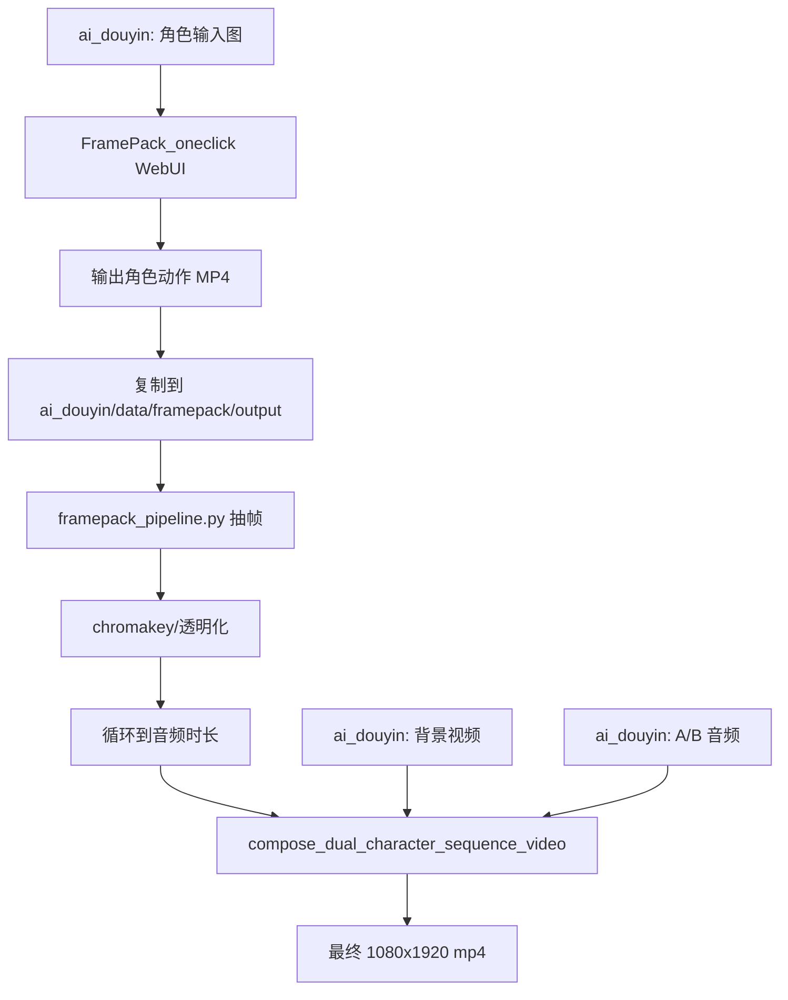

> 文档状态：当前主线文档。用于后续理解“视频背景是什么、双角色到哪一步、外部 FramePack 项目怎么给 ai_douyin 提供素材”。

# 关联项目与视频生成集成说明

更新时间：2026-05-20

## 结论先行

当前 `ai_douyin` 自己负责脚本、配音、混音、FFmpeg 合成、抖音发布；`FramePack` / `FramePack_oneclick` 不替代主项目，而是给主项目提供“人物动作短片段”和“治愈绿色背景素材”。

当前生产主线是动漫数字人主讲。`AutoPublishRequest.video_mode` 默认是 `presenter_anime`，管理后台“在线制作/发布”默认选中“动漫数字人主讲”。单人口播模板视频保留为历史/兜底模式；双角色已有对话、双声线、角色 PNG 序列和最终合成样片，并可在管理后台选择 `dual_framepack_active`。

ComfyUI 不随管理后台启动；只有 Presenter 生成动漫背景时才按需启动，背景/视频输出完成后代码会尝试关闭。

## 当前视频背景是什么

### 1. 单人口播 `auto-publish` 背景

单人口播模板视频模式使用模板视频作为背景/底片。注意：截至 2026-05-20，`python main.py auto-publish ...` 没有显式 `--mode` 参数，会使用代码里的 `AutoPublishRequest.video_mode` 默认值 `presenter_anime`；如果要使用单人口播路线，需要通过管理后台选择“单人口播模板（旧格式）”，或后续给 CLI 补 `--mode single_template`。

默认模板视频在代码里：

```text
src/services/auto_publish_service.py
DEFAULT_TEMPLATE_VIDEO = "data/videos/template.mp4"
```

模板视频路径由用户自备并放到 `data/videos/template.mp4`；不存在时模板视频模式会在合成阶段失败，可通过 `--template` 参数指定其他路径。

已核对这个文件存在：

```text
D:\IT\AI_vido\ComfyUI\vido\4月19日.mp4
768x1200, 30fps, 5.085s
```

合成方式不是重新生成背景，而是：

```text
模板视频 -> FFmpeg stream_loop 循环到配音长度 -> 替换成 TTS/BGM 音频 -> 输出最终 mp4
```

如果命令传入 `--template`，就会使用用户指定的视频作为背景/底片。

### 2. 双角色/背景替换视频背景

双角色合成里，背景是独立视频层，由 `compose_dual_character_video()` 或 `compose_dual_character_sequence_video()` 的 `background_path` 输入。

当前项目里已有这些背景资源：

| 文件 | 尺寸/时长 | 用途 |
|---|---|---|
| `data/videos/bg_loop.mp4` | 768x1200，30fps，31.566s | 早期双角色测试背景 |
| `data/videos/bg_comfy_green_loop.mp4` | 1080x1920，30fps，10s | ComfyUI 生成的绿色治愈背景循环视频 |
| `data/videos/bg_comfy_green_loop_motion.mp4` | 1080x1920，30fps，10s | 当前背景替换后的主背景，带轻微动态的绿色治愈背景 |
| `data/videos/bg_healing.png/jpg` | 静态图 | 治愈背景源素材 |

双角色最终样片：

```text
data/videos/dual_v14_framepack_idle.mp4
data/videos/dual_v14_healing_bg.mp4
```

这类视频的背景不是 FramePack 自动决定的，而是主项目在最终 FFmpeg 合成阶段叠进去。当前如果继续做背景替换/双角色合成，优先把 `data/videos/bg_comfy_green_loop_motion.mp4` 视为当前背景基准。

### 3. 观众视角背景判断

从当前几版样片看，`bg_comfy_green_loop_motion.mp4` 比星空背景和偏暗森林背景更适合让观众多停留：

- 绿色浅背景更干净，角色轮廓和脸部信息更容易被看见。
- 轻微动态能减少“静态贴图感”，但不会抢走人物注意力。
- 星空背景信息感强，但更像测试场景；暗绿色背景氛围更重，但手机端容易压暗人物。

当前建议把浅绿色动态背景作为双角色样片的主基准，后续只微调角色大小、位置、字幕和主动说话提示。

## 双角色现在什么阶段

### 已完成的组件

| 能力 | 状态 | 说明 |
|---|---|---|
| A/B 对话脚本 | 已有 | `DialogueGenerator` 可生成带 `speaker` 的结构化对话 |
| 双角色声音 | 已有 | Edge-TTS 可用不同音色生成 A/B 音频 |
| 单角色配音 | 已稳定 | GPT-SoVITS 是当前单人口播主通路 |
| 双角色视频叠加 | 已有 | `compose_dual_character_video()` 可叠角色视频/PNG |
| 双角色 PNG 序列合成 | 已有 | `compose_dual_character_sequence_video()` 可叠两组角色帧 |
| 本地微动作 | 已有 | `micro_motion.py` 可生成眨眼/呼吸 PNG 序列 |
| FramePack 后处理 | 已有 | `framepack_pipeline.py` 可抽帧、抠图、循环 |

### 当前可验证成果

```text
data/videos/dual_v13_blink_only.mp4
data/videos/dual_v14_framepack_idle.mp4
data/videos/dual_v14_healing_bg.mp4
data/videos/dual_v15_green_motion_bg.mp4
data/videos/dual_v16_green_active_speaker_official.mp4
data/videos/dual_final_v10.mp4
data/videos/dual_final_mixed.mp4
```

其中 `dual_v14_framepack_idle.mp4` 已核对为：

```text
1080x1920, 30fps, 约 31.56s
```

2026-05-13 复核结果：`D:\IT\FramePack` 目录没有发现最终双人对话 MP4；`D:\IT\FramePack_oneclick\framepack_cu126_torch26\webui\outputs\` 里主要是单角色动作短片段。之前记忆中的“两个人物对话成片”更可能是这些 FramePack 输出被 `ai_douyin` 后处理合成后的文件，例如 `dual_v14_framepack_idle.mp4`、`dual_final_v10.mp4` 或更早的 `dual_final_mixed.mp4`。

2026-05-13 背景替换测试：已用 `data/videos/bg_comfy_green_loop_motion.mp4` 重新合成 `data/videos/dual_v15_green_motion_bg.mp4`。历史背景、人物动作素材、参考音频和候选成片集中归档在 `data/asset_collections/history_dual_framepack_2026_05_13/`。

2026-05-13 正式化结果：`compose_dual_character_sequence_video()` 已增加 `active_speaker_timeline` 参数。传入 `[("A", 0, 18.504), ("B", 18.504, 31.464)]` 这类时间轴后，会在最终 FFmpeg 合成阶段让当前说话角色轻微放大、上移并提亮。正式样片为 `data/videos/dual_v16_green_active_speaker_official.mp4`。

2026-05-20 复核：当前 `src/web/app.py` 的“在线制作/发布”下拉框默认选中“动漫数字人主讲”，对应 `video_mode=presenter_anime`；“双角色主动说话正式版”对应 `dual_framepack_active`；“单人口播模板（旧格式）”对应 `single_template`。页面提示文案已同步为动漫数字人主讲。

### 仍未完成的部分

双角色还没有成为一键能力，主要差在：

1. 没有接入 `python main.py auto-publish --mode dual`。
2. FramePack 生成角色动作 MP4 仍是手动步骤。
3. 角色 A/B 的对话音频还需要更清晰的时间轴编排；当前合成函数更偏“角色 A 段 + 角色 B 段”的顺序拼接，不是完整交替对话剪辑器。
4. SadTalker 口型路线历史上受素材质量影响明显，角色 B 曾出现人脸关键点失败；当前更稳的是 PNG 序列或 FramePack 动作帧路线。
5. 缺少统一资源检查：背景、角色帧、音频、输出路径、透明通道失败时还没有产品化错误提示。

当前阶段可以定义为：

```text
双角色视频 = 技术组件和样片已跑通，生产级一键编排未完成。
```

### 主动说话角色提示

已测试“谁说话谁轻微放大/高亮”的 MVP 方案：

```text
data/videos/test_viewer_green_dual_v3_active_speaker.mp4
```

当前测试音频时间轴为：

```text
0s - 18.504s      角色 A 说话
18.504s - 31.464s 角色 B 说话
```

视觉处理方式：

- 说话角色放大到约 1.05 倍，并略微上移，制造“靠前”的感觉。
- 说话角色亮度和饱和度轻微提高。
- 非说话角色保持正常大小和亮度。
- 阴影保持柔和，避免高亮过强导致角色像按钮或贴纸。

当前结论：方案可用，但属于克制版。适合作为第一版上线风格；如果后续需要更强的短视频钩子，可以再加轻微边缘光、脚下光晕或台词级时间轴。

正式调用示例：

```python
from src.content_factory.video_composer import compose_dual_character_sequence_video

compose_dual_character_sequence_video(
    background_path="data/videos/bg_comfy_green_loop_motion.mp4",
    role_a_sequence="data/framepack/frames_looped/na1_idle_v1/%06d.png",
    role_b_sequence="data/framepack/frames_looped/n3_idle_v1/%06d.png",
    audio_a_path="data/ref_audio/role_a_concat_motion.wav",
    audio_b_path="data/ref_audio/role_b_concat_motion.wav",
    output_name="dual_v16_green_active_speaker_official",
    active_speaker_timeline=[
        ("A", 0, 18.504),
        ("B", 18.504, 31.464),
    ],
)
```

## D:\IT\FramePack 能提供什么

`D:\IT\FramePack` 更像“源码、实验和辅助工具目录”。

它当前可给 `ai_douyin` 提供：

| 能力 | 位置 | 对 ai_douyin 的作用 |
|---|---|---|
| FramePack 源码/WebUI | `D:\IT\FramePack\demo_gradio.py` | 作为理解和调试 FramePack 的源码版本 |
| 模型缓存 | `D:\IT\FramePack\hf_download\...` | 可复用 HunyuanVideo / FramePack 模型缓存，减少重复下载 |
| 背景生成工具 | `D:\IT\FramePack\tools\comfyui_green_background\` | 调用本机 ComfyUI 生成绿色治愈背景 |
| 背景素材输出 | `D:\IT\FramePack\assets\green_backgrounds\` | 给主项目提供背景静帧或预览图 |
| 方案文档 | `D:\IT\FramePack\docs\...` | 记录绿色背景、ComfyUI、FramePack 工作流 |
| 一键包压缩包 | `D:\IT\FramePack\framepack_cu126_torch26.7z` | 可重新解压/恢复 oneclick 环境 |

已存在的背景素材：

```text
D:\IT\FramePack\assets\green_backgrounds\green_healing_bg_00001_.png
D:\IT\FramePack\assets\green_backgrounds\bg_comfy_green_loop_preview.png
D:\IT\FramePack\assets\green_backgrounds\motion_preview_early.png
D:\IT\FramePack\assets\green_backgrounds\motion_preview_late.png
```

这部分对主项目最有价值的是：生成和沉淀背景素材，然后复制或转码到 `D:\IT\ai_douyin\data\videos\`。

## D:\IT\FramePack_oneclick 能提供什么

`D:\IT\FramePack_oneclick` 是实际可运行的一键包环境。

关键目录：

```text
D:\IT\FramePack_oneclick\framepack_cu126_torch26
  run.bat
  environment.bat
  system\python\
  webui\demo_gradio.py
  webui\hf_download\
  webui\outputs\
```

它当前可给 `ai_douyin` 提供：

| 能力 | 位置 | 对 ai_douyin 的作用 |
|---|---|---|
| 可直接启动的 FramePack WebUI | `run.bat` | 手动生成角色动作视频 |
| 独立 Python 运行时 | `system\python\python.exe` | 不污染 `ai_douyin` 主环境 |
| 本地模型缓存 | `webui\hf_download\...` | 已能本地加载模型 |
| 角色动作 MP4 输出 | `webui\outputs\*.mp4` | 拷贝到 `data/framepack/output/` 后进入主项目后处理 |
| 运行日志 | `framepack_stdout.log` / `framepack_stderr.log` | 判断是否启动成功、显存模式、端口 |

日志显示它已能在本机启动：

```text
http://127.0.0.1:7862
Free VRAM: 约 14.65 GB
Using local HunyuanVideo / flux_redux_bfl / FramePackI2V_HY snapshots
```

已存在的动作输出示例：

```text
D:\IT\FramePack_oneclick\framepack_cu126_torch26\webui\outputs\n3_idle_v1.mp4
544x704, 30fps, 3.5s

D:\IT\FramePack_oneclick\framepack_cu126_torch26\webui\outputs\a1.mp4
544x704, 30fps, 4.83s
```

这部分对主项目最有价值的是：作为“人物动作短片段生成器”。

## 建议的集成方式

当前不要让 `ai_douyin` 直接调用 FramePack 推理。更稳的方式是外部生成、项目内合成：



推荐目录约定：

```text
FramePack_oneclick 输出:
D:\IT\FramePack_oneclick\framepack_cu126_torch26\webui\outputs\n3_idle_v1.mp4

复制/归档到主项目:
D:\IT\ai_douyin\data\framepack\output\n3_idle_v1.mp4

主项目处理后:
D:\IT\ai_douyin\data\framepack\raw_frames\n3_idle_v1\
D:\IT\ai_douyin\data\framepack\frames_alpha\n3_idle_v1\
D:\IT\ai_douyin\data\framepack\frames_looped\n3_idle_v1\

最终视频:
D:\IT\ai_douyin\data\videos\dual_v14_framepack_idle.mp4
```

## 后续产品化路线

### 第一阶段：固定半自动规范

目标：先让人知道文件放哪里、命名叫什么、怎么合成。

- 统一角色动作命名：`na1_idle_v1.mp4`、`n3_idle_v1.mp4`
- 统一背景命名：`bg_healing_loop.mp4`
- 统一最终输出命名：`dual_framepack_{topic}_{timestamp}.mp4`
- 文档中固定“从 oneclick outputs 复制到 ai_douyin data/framepack/output”的步骤

### 第二阶段：在 ai_douyin 中增加导入命令

新增一个轻量命令，不直接跑 FramePack，只负责导入外部输出：

```bash
python main.py import-framepack-output --src D:\IT\FramePack_oneclick\framepack_cu126_torch26\webui\outputs\n3_idle_v1.mp4 --name n3_idle_v1
```

它做三件事：

1. 复制 MP4 到 `data/framepack/output/`
2. 检查 ffprobe 信息
3. 提示下一步处理命令

### 第三阶段：把双角色接入发布模式

给 `auto-publish` 增加模式：

```bash
python main.py auto-publish --mode single --keywords "成长"
python main.py auto-publish --mode dual-framepack --keywords "成长"
```

`dual-framepack` 只消费已经生成好的角色动作 MP4，不负责现场调用 FramePack。

## 当前判断

`D:\IT\FramePack` 和 `D:\IT\FramePack_oneclick` 对本项目的价值不是“替换视频生成模块”，而是作为外部素材生产线：

- `D:\IT\FramePack`：沉淀源码、模型缓存、背景生成工具、实验文档。
- `D:\IT\FramePack_oneclick`：稳定启动 WebUI，产出人物动作 MP4。
- `ai_douyin`：接收这些素材，做抽帧、透明化、循环、配音合成、发布。

这样边界最清楚，也最容易排查问题。
