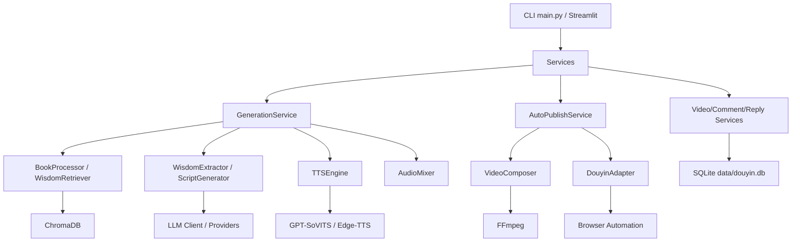
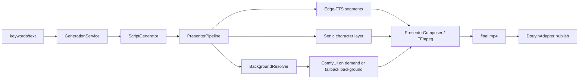

> 文档状态：当前主线文档，可以作为当前项目状态或实施依据。

# AI Douyin 系统架构说明

更新时间：2026-05-20

## 项目定位

`ai_douyin` 是一个本地运行的 AI 短视频内容生成与抖音运营自动化项目。当前主线目标是把“内容生产”和“平台操作”连成可用工具，而不是先做服务化平台。

当前已落地的主链路：

```text
关键词/文本
  -> 书籍/RAG 知识
  -> LLM 生成脚本
  -> Edge-TTS 分段配音
  -> Sonic 角色视频层
  -> 动漫背景
  -> FFmpeg 合成 Presenter 视频
  -> 抖音浏览器自动化发布
  -> 同步视频/评论
  -> 自动回复
```

## 当前架构图



## 模块职责

| 模块 | 位置 | 职责 |
|---|---|---|
| CLI | `main.py` | 参数解析和服务调用 |
| Web | `src/web/app.py` | Streamlit 管理后台 |
| 服务层 | `src/services/` | 编排生成、发布、同步、评论、回复 |
| 内容工厂 | `src/content_factory/` | 文案、TTS、混音、视频合成、微动作 |
| 知识检索 | `src/rag_engine/` | 书籍导入和 Chroma 检索 |
| 平台适配 | `src/platform_adapter/` | 抖音浏览器自动化 |
| 共享层 | `src/shared/` | 配置、日志、数据库、LLM Provider |
| 数据目录 | `data/` | 书籍、向量库、视频、浏览器登录态、SQLite |

## 视频生成架构

### 动漫数字人主讲视频

当前生产主线：



关键点：

- 管理后台和 `AutoPublishRequest.video_mode` 当前默认 `presenter_anime`。
- ComfyUI 不随平台启动，只在 Presenter 背景生成阶段按需启动；生成完成后代码会尝试关闭。
- ComfyUI 不可用时，背景会回退到本地兜底背景。
- 单人口播模板视频仍由 `compose_video()` 支持，但现在是历史/兜底模式。

### 双角色与序列视频

已具备组件：

- `DialogueGenerator`：生成 A/B 对话脚本。
- `TTSEngine(provider_type="edge")`：生成双角色音频。
- `compose_dual_character_video()`：叠加角色视频或 PNG。
- `compose_dual_character_sequence_video()`：叠加两组 PNG 序列。
- `micro_motion.py`：生成眨眼/呼吸角色序列。
- `framepack_pipeline.py`：处理 FramePack 输出后的帧序列。

当前状态：

- 可本地验证成片。
- 管理后台可选择 `dual_framepack_active`。
- 需要补资源检查、模式选择和失败回退。

## 平台运营架构

抖音平台能力通过浏览器自动化实现：

- 登录态：`data/browser/douyin/`
- 发布：上传视频、标题、描述、话题、可见性
- 同步：读取创作者后台视频列表
- 评论：抓取评论，写入 SQLite
- 回复：规则/LLM/默认回复，浏览器发送

数据落地：

- `data/douyin.db`
- 视频表、评论表、回复历史、规则、违禁词、用户配置等

## 配置入口

主要配置在 `.env` 和 `src/shared/config.py`：

- LLM：`LLM_PROVIDER`、`OLLAMA_BASE_URL`、`OLLAMA_MODEL`
- TTS：`TTS_PROVIDER`、`GPT_SOVITS_*`
- 存储：`VIDEOS_DIR`、`BOOKS_DIR`、`CHROMA_PERSIST_DIR`
- 抖音：`DOUYIN_*`
- 浏览器：`BROWSER_*`

## 当前缺口

- 没有 FastAPI 服务入口。
- 没有后台队列和 Worker。
- 没有定时调度。
- 没有 Docker/compose 部署契约。
- 双角色/FramePack 仍需要补素材检查和失败回退。

## 下一阶段架构建议

优先补齐生成侧模式编排：

```text
AutoPublishService
  -> mode=presenter_anime          动漫数字人主讲，当前默认
  -> mode=single_template          单人口播模板视频，历史/兜底
  -> mode=dual_framepack_active    双角色 FramePack 主动说话，可选增强
```

每种模式都应统一：

- 输入资源检查
- 产物命名
- 日志和错误信息
- 最终视频路径输出
- 可选发布到抖音

等这些稳定后，再进入 API、任务队列和部署。
