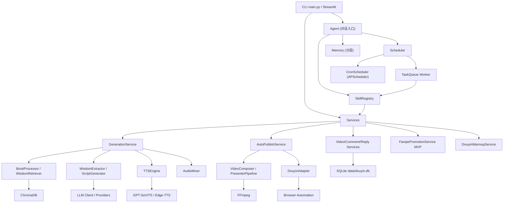
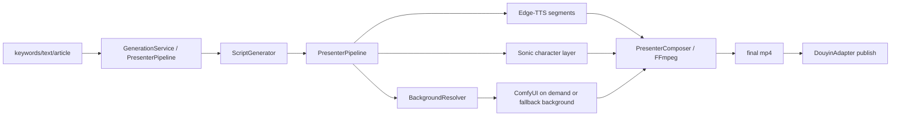

> 文档状态：当前主线文档，可以作为当前项目状态或实施依据。

# AI Douyin 系统架构说明

更新时间：2026-06-15

## 项目定位

`ai_douyin` 是一个本地运行的 AI 短视频内容生成与抖音运营自动化项目。当前主线目标是把"内容生产"、"平台操作"和"对话式 AI 调度"连成可用工具，而不是先做服务化平台。

当前已落地的主链路：

```text
关键词/文本/文章
  -> 书籍/RAG 知识
  -> LLM 生成脚本
  -> Edge-TTS 分段配音
  -> Sonic 角色视频层
  -> 动漫背景
  -> FFmpeg 合成 Presenter 视频
  -> 抖音浏览器自动化发布
  -> 同步视频/评论
  -> 自动回复

对话入口（Agent / Skill）：
  用户消息 -> Memory 分层记忆 -> Agent LLM 决策 -> Skill Registry -> 上述任一能力 -> 写回记忆
```

## 当前架构图



## 模块职责

| 模块 | 位置 | 职责 |
|---|---|---|
| CLI | `main.py` | 参数解析和服务调用 |
| Web | `src/web/app.py` | Streamlit 管理后台（含调度管理页面） |
| Agent | `src/agent/` | 对话入口、Skill 注册表、LLM 计划生成与用户确认拦截 |
| Memory | `src/memory/` | 用户画像、会话/消息、分层记忆（对话/偏好/问题）、问题跟进 |
| Scheduler | `src/scheduler/` | 定时任务（APScheduler）+ 任务队列 + 后台 Worker |
| 服务层 | `src/services/` | 编排生成、发布、同步、评论、回复 |
| 内容工厂 | `src/content_factory/` | 文案、TTS、混音、视频合成、微动作、Presenter 管线 |
| 知识检索 | `src/rag_engine/` | 书籍导入和 Chroma 检索 |
| 平台适配 | `src/platform_adapter/` | 抖音发布/同步/评论、抖音养号、番茄推广 MVP、浏览器会话封装 |
| 共享层 | `src/shared/` | 配置、日志、数据库、LLM Provider |
| 数据目录 | `data/` | 书籍、向量库、视频、浏览器登录态、SQLite |

## Agent / Memory / Scheduler 概要

### 对话式入口：`src/agent/`

- `Agent.chat()`：接收用户消息 → 自动入库 MemoryLayer → 注入用户偏好 + 最近对话 → 调 LLM 生成回复或计划。
- 计划拦截：`requires_confirmation=True` 的 Skill 由 LLM 输出 `​```plan ... ```​` 块，用户回复"确认/取消"才执行。
- `SkillRegistry`：注册 18+ Skill（生成/发布/同步/评论/养号/番茄/知识库/记忆管理等），所有能力可由 LLM 调用。
- 出错兜底：任何异常都会被 `_handle_chat_failure` 接住，记录到 ProblemMemory 并返回兜底文本，绝不抛到 UI。

### 分层记忆：`src/memory/`

- `MemoryManager`：用户画像（偏好、抖音账号绑定）、会话、消息、待确认计划、对话历史。
- `MemoryLayerManager` / `ProblemMemory`：把消息自动分成 `preference / problem / discarded / normal`；`problem` 自动入 ProblemMemory；定期 cron 调用 `investigate_problems` 让 LLM 给调查摘要。
- 滑动窗口：单会话保留最近 20 条 `normal` 消息，超出自动丢弃。

### 任务调度：`src/scheduler/`

- `models.py`：`ScheduledTask` / `TaskExecution` 两张表，状态机 `pending → running → completed/failed/cancelled`，支持 `max_retries` 重试。
- `cron.py`：APScheduler 包装，定时/间隔触发；到期只入队，不直接执行。
- `queue.py`：`TaskQueue.worker_loop()` 后台线程 `SELECT ... FOR UPDATE SKIP LOCKED` 抢任务，调 SkillRegistry 执行。
- `ui.py`：Streamlit "任务调度"页面（仪表板 / 定时任务 / 队列 / 执行记录）。
- `runner.py`：app.py 启动时静默拉起调度器和 Worker。

## 视频生成架构

### 动漫数字人主讲视频

当前生产主线：



关键点：

- 管理后台和 `AutoPublishRequest.video_mode` 当前默认 `presenter_anime`。
- ComfyUI 不随平台启动，只在 Presenter 背景生成阶段按需启动；生成完成后代码会尝试关闭。
- ComfyUI 不可用时，背景会回退到本地兜底背景。
- 单人口播模板视频仍由 `compose_video()` 支持，但现在是历史/兜底模式。

### 双角色与序列视频

已具备组件：

- `DialogueGenerator`：生成 A/B 对话脚本。
- `TTSEngine(provider_type="edge")`：生成双角色音频。
- `compose_dual_character_video()`：叠加角色视频或 PNG。
- `compose_dual_character_sequence_video()`：叠加两组 PNG 序列。
- `micro_motion.py`：生成眨眼/呼吸角色序列。
- `framepack_pipeline.py`：处理 FramePack 输出后的帧序列。

当前状态：

- 可本地验证成片。
- 管理后台可选择 `dual_framepack_active`。
- 需要补资源检查、模式选择和失败回退。

## 平台运营架构

抖音平台能力通过浏览器自动化实现：

- 登录态：`data/browser/douyin/`
- 发布：上传视频、标题、描述、话题、可见性
- 同步：读取创作者后台视频列表
- 评论：抓取评论，写入 SQLite
- 回复：规则/LLM/默认回复，浏览器发送

抖音账号养号支线：

- 代码：`src/platform_adapter/douyin_warmup.py`
- 数据：`data/douyin_warmup/`
- 能力：多账号 profile、手动登录、低频观看、评论区浏览、可控视频/评论点赞

番茄小说推广 MVP：

- 代码：`src/platform_adapter/fanqie_promotion.py`
- 浏览器会话：`data/browser/fanqie/`
- 任务与章节素材：`data/fanqie_promotion/`
- 能力：番茄达人中心登录、申请推广、获取小说章节、生成推广脚本和 Presenter 视频
- 边界：页面 DOM、验证码/短信/安全验证和推广申请结果仍需人工实测；绑定抖音视频 ID 尚未实现

数据落地：

- `data/douyin.db`
- 视频表、评论表、回复历史、规则、违禁词、用户配置等
- 记忆系统：`user_profiles` / `conversation_sessions` / `conversation_messages` / `user_memory` / `problem_memory` / `conversation_memory`
- 调度系统：`scheduled_tasks` / `task_executions`

## 配置入口

主要配置在 `.env` 和 `src/shared/config.py`：

- LLM：`LLM_PROVIDER`、`OLLAMA_BASE_URL`、`OLLAMA_MODEL`
- TTS：`TTS_PROVIDER`、`GPT_SOVITS_*`
- 存储：`VIDEOS_DIR`、`BOOKS_DIR`、`CHROMA_PERSIST_DIR`
- 抖音：`DOUYIN_*`
- 浏览器：`BROWSER_*`

## 当前缺口

- 没有 FastAPI 服务入口。
- 没有 Docker/compose 部署契约。
- 双角色/FramePack 仍需要补素材检查和失败回退。
- 番茄推广仍是 MVP CLI，尚未拆成正式 `src/novel_promotion/` 包，也未接管理后台。
- Agent 当前只暴露在 Streamlit；尚未拆为独立 HTTP/WebSocket 服务。

## 下一阶段架构建议

Agent + Skill Registry + Scheduler 已经把"内容生产"和"平台操作"的所有能力挂在同一层，下一步优先补齐：

```text
FastAPI 网关 (HTTP/WebSocket)
  -> 对话接口 ↔ Agent
  -> 任务接口   ↔ TaskQueue.enqueue
  -> 平台回调   ↔ Skill

Scheduler
  -> cron/interval trigger  （已落地）
  -> 条件触发器（评论阈值/视频发布后） （已建模，未实现）
```

等 FastAPI 落地后再补：

- 多用户隔离（目前 `user_id="default"`）
- 鉴权与限流
- 跨进程任务队列（目前 SQLite + SKIP LOCKED，仅适合单进程 Worker）