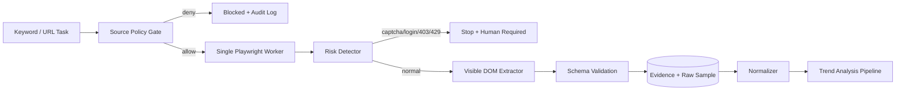

> 文档状态：目标架构。未经书面授权，自动网页采集层必须保持关闭。

# 网页采集版热点情报与原创脚本系统架构

更新时间：2026-08-26

## 1. 技术选择

第一版继续使用 **Python**：

- Playwright：处理 JavaScript 动态页面；
- httpx：只处理明确允许直接请求的静态页面；
- SQLAlchemy/Alembic：样本、快照、授权和脚本数据；
- 现有 Scheduler：低频任务和分析任务；
- LLMClient/embedding：聚类、简报和原创脚本；
- Streamlit：人工选样、证据、审核和样片入口。

不新增 Go 服务。网页浏览不是当前性能瓶颈，项目已有 `BrowserSession`，用 Python 接入成本最低。

## 2. 双模式架构

```text
模式 A（默认）
人工浏览 → CSV/URL/自有数据导入 → 分析与创作

模式 B（授权后）
Source Policy Gate → Playwright 网页采集 → DOM 证据与指标快照
                                      ↓
统一模型 → 法律过滤 → 聚类/评分 → TrendBrief → 原创脚本
                                      ↓
事实/原创性/人工审核 → 锁定脚本 → Video Pipeline V2（当前停用）→ 人工审核/发布
```

两种模式进入同一套 `TrendProvider` 合约。业务层不关心数据来自人工导入还是授权网页采集，但 UI 必须清楚显示来源和覆盖范围。

## 3. 模块边界

### apachong 参考框架的采用方式

`D:\IT\apachong` 只作为本地设计参考，不作为 editable dependency，也不复制整套电商采集系统。采用“保留现有能力、抽取中性骨架、平台能力重写”的方式：

| 分类 | 决策 |
|---|---|
| 直接保留 | `ai_douyin` 的 BrowserSession、Scheduler、SQLAlchemy/Alembic、LLMClient、工作流契约和日志体系 |
| 参考后实现 | Source Policy、CollectionJob 状态机、Checkpoint、按来源限速/页数预算；后续实现精简 Capture Bundle |
| 按趋势领域新写 | 统一内容模型、抖音可见 DOM Extractor、法律分类、聚类、趋势评分、TrendBrief |
| 明确排除 | 拼多多/店铺模型、anti-detect、代理切换、验证码识别、内部接口监听或重放、敏感原始响应长期保存 |

现有 `src/shared/rate_limiter.py` 是 LLM QPS 限流器，继续原用途且不修改。趋势采集使用独立的 `CollectionRateLimiter`，表达书面授权中的最小访问间隔和页面预算，避免把两种限流语义混在一起。

### 保留现有模块

- `src/platform_adapter/douyin_adapter.py`：自有账号发布、同步和评论；
- `src/platform_adapter/browser_session.py`：可复用浏览器子进程和基础 DOM 命令；
- `src/shared/llm_client.py`：LLM 治理；
- `src/workflow/`：统一节点契约与人工切换；视频生成节点当前 fail-closed；
- `src/scheduler/`：任务调度；
- `src/web/app.py`：只注册热点选题页面。

### 新增热点模块

```text
src/trend_intelligence/
├── __init__.py
├── models.py
├── schemas.py
├── repository.py
├── service.py
├── source_policy.py             # 授权、域名、路径、用途、频率门禁
├── collection/
│   ├── __init__.py
│   ├── job.py                    # 平台无关状态机与策略门编排
│   ├── checkpoint.py             # 原子落盘与断点恢复
│   └── rate_limiter.py           # 按来源间隔和硬页数预算
├── normalizer.py
├── metric_service.py
├── domain_classifier.py
├── clusterer.py
├── ranker.py
├── brief_builder.py
├── script_generator.py
├── originality_guard.py
├── fact_guard.py
├── ui.py
└── providers/
    ├── base.py
    ├── mock.py
    ├── manual_import.py
    ├── owned_account_export.py
    ├── licensed_feed.py
    └── authorized_web/
        ├── provider.py
        ├── browser.py            # 独立采集会话，不复用发布登录态
        ├── navigator.py          # 配置化页面导航
        ├── risk_detector.py      # 登录/验证码/风控/限流检测
        ├── evidence.py           # URL、采集时间、截图/hash
        └── extractors/
            ├── base.py
            ├── search_results.py
            ├── topic_or_hot.py
            └── video_detail.py
```

第一批运行骨架不能启动浏览器或发起网络请求；Provider 必须显式调用 Source Policy Gate 获得 `allowed` 后，才可进入 I/O 层。

Checkpoint 只保存游标、页数、条目数和停止原因，不允许 Cookie、Authorization、storage state 或访问令牌。恢复中的任务统一回到 `queued`，必须用当前时间、当前授权状态和剩余预算重新经过 Source Policy Gate。

## 4. Source Policy Gate

所有 Provider 在运行前都通过同一个策略门：

```python
class SourcePolicyDecision:
    allowed: bool
    reason: str
    allowed_hosts: list[str]
    allowed_paths: list[str]
    allowed_fields: list[str]
    allowed_purposes: list[str]
    max_pages_per_run: int
    min_interval_seconds: int
    expires_at: datetime | None
```

策略来源：

```text
manual_import        默认允许
owned_account_export 需登记账号和导出权限
licensed_feed        需登记合同/许可
authorized_web       必须登记书面授权
```

网页任务只有在以下条件全部满足时执行：

```text
WEB_CRAWLER_ENABLED=true
source_policy.status=approved
当前 host/path 在白名单
purpose 包含 trend_analysis
若使用 LLM，purpose 还需包含 generative_processing
授权未过期
请求预算未耗尽
```

## 5. BrowserSession 使用方式

现有 `BrowserSession` 适合复用：

- Windows/Python 3.14 的 Playwright 子进程隔离；
- 持久浏览器上下文；
- `goto`、`wait_for_selector`、DOM 文本/属性和截图；
- 子进程失败隔离和现有日志体系。

需要扩展但不修改原职责：

```text
独立的 TREND_BROWSER_USER_DATA_DIR
独立的 TREND_BROWSER_STORAGE_STATE_PATH
DOM 批量结构化读取命令
当前页面标题/HTML hash
风险页检测结果
每次访问的时间和预算记录
安全停止与任务续跑游标
```

不复用发布会话目录，不把 Cookie/localStorage 写入趋势数据库或 QA 包。

## 6. 授权网页采集流程



### 页面导航

- URL 模板放配置文件，不写死在 Provider；
- 每次只处理一个关键词或一页；
- 只用正常页面交互和可见 DOM；
- 不无限滚动；滚动/翻页次数必须有授权预算；
- DOM 结构变化时失败关闭，不猜测错误字段。

### 风险检测

遇到以下任一条件立即停止当前域名采集：

```text
登录要求变化
验证码/安全验证
访问频繁/系统繁忙
HTTP 403/429
重定向到安全页
页面内容为空或字段异常大面积缺失
授权/robots/协议版本变化
```

不自动刷新、换代理或切账号继续尝试。

## 7. Extractor 合约

```python
class PageExtractor(Protocol):
    page_type: str
    schema_version: str

    def matches(self, page: BrowserPage) -> bool:
        ...

    def extract(self, page: BrowserPage) -> PageExtraction:
        ...
```

`PageExtraction`：

```text
page_url / canonical_url / page_type
query / page_rank / content_id
title / caption_excerpt / hashtags
author_display_name / author_id_hash
published_at
displayed_metrics
collected_at
selector_profile / parser_version
evidence_hash / quality_flags
```

Selector 采用版本化配置：

```text
config/trend_web/douyin/search_results_v1.yaml
config/trend_web/douyin/video_detail_v1.yaml
```

每个配置包含主选择器、有限备用选择器和必填字段。备用选择器只处理已知页面变体，不用于规避风控。

## 8. 数据与证据模型

### `trend_source_policies`

```text
provider / status / authorization_holder
allowed_hosts_json / allowed_paths_json
allowed_fields_json / allowed_purposes_json
min_interval_seconds / max_pages_per_run / daily_page_cap
raw_retention_days / normalized_retention_days
authorization_file_hash / starts_at / expires_at
reviewed_by / reviewed_at
```

### `trend_collection_runs`

保存关键词、页面类型、策略 ID、预算、游标、状态和停止原因。

状态机：

```text
queued → policy_checked → running → completed
   └────────→ blocked / human_required / parser_broken / partial
```

### `trend_page_evidence`

```text
run_id / source_url / collected_at
page_title / parser_version / content_hash
screenshot_path（可选）
raw_snapshot_path（可选）
expires_at / deletion_status
```

### `trend_items` 与 `trend_metric_snapshots`

沿用统一内容和指标模型。数字缩写如“2.8万”需要保存：

```text
raw_display_value="2.8万"
normalized_value=28000
metric_quality="approximate"
```

## 9. 法律领域分析

```text
规则关键词召回
→ 排除娱乐/穿搭等误召回
→ embedding 语义分类
→ 文案 hash 和近重复去重
→ 同话题聚类
→ 样本评分或趋势评分
```

必须保留：查询词、页面位置、采集时间、会话范围、样本来源和指标质量。

## 10. TrendBrief 与原创脚本

模型输入使用话题簇摘要，不使用单条视频完整文案：

```json
{
  "cluster_title": "",
  "sample_scope": {
    "source": "manual_import_or_authorized_web",
    "queries": [],
    "collected_at": "",
    "coverage": "sample_only"
  },
  "source_summaries": [],
  "displayed_metrics": {},
  "verified_legal_facts": [],
  "unverified_claims": [],
  "overused_angles": [],
  "new_angles": []
}
```

输出三种角度：普法解释、生活场景、行动清单。脚本必须经过来源、法规时效、个案事实、原创性、敏感表达和人工审核。

## 11. 调度模型

默认模式只调度数据分析：

```text
process_imported_samples
recompute_trend_clusters
build_daily_legal_digest
expire_raw_evidence
```

授权网页采集初期仍由人工触发。只有授权明确允许无人值守定时采集并稳定运行后，才增加：

```text
collect_authorized_web_samples
refresh_authorized_web_metrics
```

采集 Worker 必须与视频生成任务分开预算；MVP 可共用队列但不能在同一任务里采集和生成视频。

## 12. 安全与禁止项

- 不使用代理池、Cookie 池、账号池、验证码识别；
- 不修改浏览器指纹或使用 stealth 插件；
- 不逆向、重放网页内部接口；
- 不保存 Cookie、localStorage、token 或完整用户档案；
- 不采集评论用户、私信、粉丝关系；
- 不下载第三方原视频做批量 ASR；
- 不因采集失败自动切换到更激进方式；
- 不将网页样本称为官方全量热榜；
- 不将未核验法律内容直接生成并发布。

## 13. 降级策略

| 情况 | 降级 |
|---|---|
| 无书面授权 | 只启用人工导入/自有导出/许可数据源 |
| 授权到期 | 立即阻断新网页任务，保留审计记录 |
| 验证码/风控 | `human_required`，停止而非绕过 |
| DOM 变化 | `parser_broken`，回归测试后升级 selector profile |
| 指标缺失 | 只输出文本相关性和样本排序，不算增长趋势 |
| 只有一次快照 | 输出 `sample_score` |
| LLM 不可用 | 保留排行，不生成简报和脚本 |
| 法律证据不足 | 阻断脚本批准及进入任何视频项目 |

## 14. 架构验收标准

- 默认配置不会自动访问抖音；
- 网页 Provider 缺少有效书面授权时被 Source Policy Gate 拦截；
- 发布登录态与趋势采集会话完全隔离；
- 验证码、403、429 不会触发规避行为；
- DOM 变更不会静默写入错误数据；
- 每条数据可追溯到 URL、查询、采集时间和解析版本；
- 每个趋势分显示样本范围和指标质量；
- 每个脚本可追溯到 TrendBrief 和来源；
- 未审核脚本不能创建生产视频项目；
- 原始证据可按保存期限删除。
