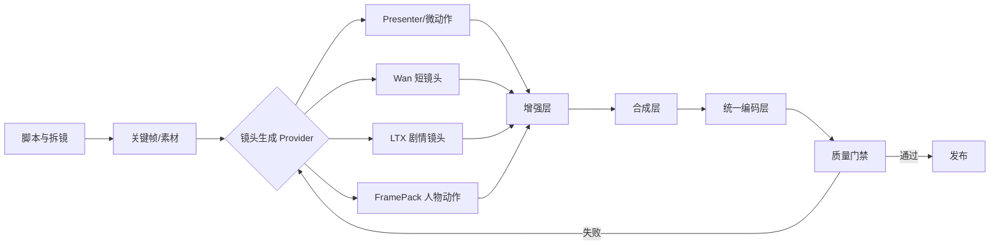

# 视频质量控制与架构改造建议

## 结论

项目不需要推翻现有视频生产框架，但需要将“模型生成质量、画面增强、最终编码、自动质检”拆成独立层，并提供统一的质量配置。

短期应继续以 **动漫数字人 / 关键帧背景 / FramePack 微动效 / FFmpeg 合成** 作为稳定量产主线。Wan 和 LTX 应作为按镜头调用的生成能力，不应在当前状态下直接承担整条视频的默认生产。

本次改造前，主要问题不是单纯码率低，而是：

1. 生成源分辨率、帧率和采样质量没有与最终输出规格统一。
2. 多条合成路径分别硬编码编码参数，无法选择预览、发布或母版质量。
3. 缺少超分、插帧和高质量缩放的统一增强层。
4. 缺少对花屏、灰屏、静止、低码率和音画异常的自动质检。
5. ComfyUI 背景生成的降级重试预设未真正传入工作流。

## 实施状态（2026-07-21）

本方案的基础实现已完成：

- P0 已完成：统一 `VideoQualityProfile`、发布档统一编码、ComfyUI 重试参数真实传递、BT.709 元数据和 `+faststart`。
- P1 已完成第一阶段：Lanczos 高质量缩放、可选 FFmpeg 插帧接口、较高的背景首选生成尺寸，以及透明/色键角色素材检查。AI 超分仍保留为独立 Provider 的后续能力。
- P2 已完成第一阶段：最终文件和角色素材均会生成 `.quality.json` 诊断报告，检查规格、黑/灰/条纹帧、静止帧、清晰度、码率和颜色元数据。
- Wan/LTX 尚未接入正式生产 Provider，因此模型 seed、工作流版本和失败重生成队列仍属于后续集成项。

## 已核实的当前链路

### 1. Presenter 动漫数字人主线

当前主线为：

```text
脚本 → 分段配音 → ComfyUI/本地背景 → Sonic/静态人物 → 字幕图层 → 分段 FFmpeg 合成 → 无损拼接 → 可选 BGM 混音
```

优点：

- 最终画布已是 `1080x1920`、`30fps`，适合竖屏发布。
- 字幕在目标分辨率直接渲染，不存在字幕后放大造成的发虚。
- 分段拼接使用 concat stream copy，不会对每一段再次重编码。
- 当前样片的人物、字幕和背景图层边缘整体可接受。

限制：

- 背景图优先以 `832x1472` 生成，OOM 时依次降级到 `768x1344` 和 `640x1120`；最终合成使用 Lanczos 缩放到目标画布。
- 主合成器已统一由质量档位控制；默认发布档为 `libx264 + preset medium + 3 Mbps CBR`，避免低复杂度动漫画面被 CRF 压到平台二压前的低码率。
- 角色视频使用色键抠图时，边缘质量受源素材、色键容差和压缩共同影响。

关键实现位置：

- `src/content_factory/presenter/presenter_composer.py`
- `src/content_factory/presenter/background_resolver.py`
- `src/content_factory/presenter/text_overlay.py`

### 2. Wan 2.2 实验链路

现有 Wan 工作流参数为：

| 项目 | 当前值 | 评价 |
|---|---:|---|
| 生成尺寸 | `540x960` | 适合预览，不宜直接作为发布源 |
| 帧率 | `16fps` | 运动流畅度不足，需要插帧或改用更高帧率来源 |
| 帧数 | `81` | 约 5 秒镜头，适合拆镜工作流 |
| 采样步数 | `4` | 加速预览用途，不是最终质量档 |
| CFG | `1.0` | 适合特定加速 LoRA，不适合泛化为高质量默认值 |

已检查样片 `assets/samples/s1_wan_final_00001.mp4`：关键帧图像正常，但视频抽帧出现灰色条纹和内容坍缩。因此当前问题优先级是 **Wan 的 VAE/latent/工作流兼容性或解码输出异常**，并非提高 H.264 码率或降低 CRF 可以解决。

在该问题修复并完成自动质检前，Wan 不应进入正式默认生产路径。

### 3. LTX 2.3 实验链路

LTX 已验证可从故事板生成视频，但当前记录显示：

- 约 `704x1248` 原生尺寸，需要后期增强到最终竖屏规格。
- 16GB 显存下单段生成约 15 分钟，不适合大规模默认量产。
- 手部稳定性与角色一致性仍需通过镜头设计缓解。

建议将 LTX 定位为“重要剧情镜头生成器”：单镜头 3–6 秒，生成完成后单独质检、增强和拼接。

## 当前明确缺陷

### A. ComfyUI 降级重试预设已修复

当前代码定义并真实使用三档重试预设：

```text
832x1472, 8 steps
768x1344, 6 steps
640x1120, 6 steps
```

`ComfyAttempt` 会传给 `_create_comfy_background()`，并直接写入工作流中的 `EmptyLatentImage.width`、`EmptyLatentImage.height`、`batch_size` 和 `KSampler.steps`。OOM 重试现在会真正降低请求成本。

### B. 编码参数已统一到质量档位

`PresenterComposer`、`compose_video()` 和两种双角色合成函数均使用 `VideoQualityProfile`。`PresenterRequest`、`AutoPublishRequest`、CLI 与管理后台均可选择 `preview`、`publish`、`master`。

旧调用仍可传入 `crf` 做兼容性覆盖，但新业务调用应只选择质量档位。

### C. 增强层和质量门禁已完成基础实现

最终合成完成后会执行 `VideoQualityGate`。模型视频或最终文件出现规格不符、黑/灰/条纹帧、时长不一致等阻断级问题时，合成函数返回失败；低码率、静止镜头、清晰度偏低和颜色元数据缺失会写入告警报告。

`data/anti_fraud_scenes/anti_fraud_full.mp4` 的最终规格是 1080x1920，但 71.8 秒文件仅约 2 MB，总码率约 231 kbps。对于简单平涂内容这不一定立刻可见，但经过平台二次压缩后会增加色带和细节损失风险。

## 目标架构



### 1. 统一质量配置：`VideoQualityProfile`（已实现）

独立配置模型位于 `src/content_factory/video_quality.py`。所有最终合成路径都使用 profile；保留的 `crf` 参数用于兼容旧调用。当前发布档兼容参数为 CRF 19、preset medium；默认最终编码仍采用下表的 3 Mbps CBR。

建议至少提供以下档位：

| 档位 | 用途 | 分辨率 / 帧率 | 视频编码 |
|---|---|---|---|
| `preview` | 后台确认、模型试跑 | `540x960`，16/24fps | `1 Mbps CBR`, `fast` |
| `publish` | 抖音正式发布 | `1080x1920`，30fps | `3 Mbps CBR`, `medium` |
| `master` | 本地归档和二次剪辑 | `1080x1920`，30fps | `6 Mbps CBR`, `slow` |

发布档默认建议：

```text
-c:v libx264
-preset medium
-b:v 3M
-minrate 3M
-maxrate 3M
-bufsize 6M
-profile:v high
-level 4.2
-pix_fmt yuv420p
-colorspace bt709
-color_primaries bt709
-color_trc bt709
-movflags +faststart
-c:a aac
-b:a 192k
```

如果有文件大小上限，再增加 `maxrate` 和 `bufsize` 做受控码率，而不是直接以很低平均码率输出。

### 2. 增强层：`VideoEnhancer`（已实现第一阶段）

该层只负责改善模型输出，不承担脚本或业务逻辑。

职责：

- 使用高质量缩放：`scale=1080:1920:flags=lanczos`。
- 模型低清输出优先经过超分，再缩小到 1080x1920 作为发布文件。
- 对 16fps / 24fps 的模型镜头按需插帧到 30fps。
- 控制轻度去噪、锐化和渐变防色带，避免“过锐但细节发糊”。
- 保留模型原始输出，不以发布编码文件覆盖原始文件。

第一阶段已实现 FFmpeg Lanczos 缩放、适配/裁切、规格归一和可选 `minterpolate` 插帧接口。AI 超分尚未绑定具体模型，后续可作为独立 Provider 接入，避免把模型依赖耦合到合成器。

### 3. 质量门禁：`VideoQualityGate`（已实现第一阶段）

质量门禁在发布前对每个镜头和最终文件执行检查。

最低检查项：

| 类别 | 检查内容 | 失败处理 |
|---|---|---|
| 文件完整性 | ffprobe 可读取、时长大于 0 | 阻断 |
| 规格 | 宽高、FPS、像素格式符合 profile | 重编码或阻断 |
| 时长 | 音频与视频时长误差可控 | 重合成 |
| 帧异常 | 灰屏、黑帧、条纹帧比例 | 阻断并重生成 |
| 静止 | 相邻帧长时间无变化 | 标记复审或重生成 |
| 清晰度 | 拉普拉斯方差等基础清晰度指标 | 标记复审 |
| 发布信息 | 文件大小、平均码率、颜色空间 | 提示或阻断 |

第一版不接入视觉大模型。它基于 ffprobe、抽帧图像统计和帧间差异检测，可拦住规格错误、花屏风险、灰/黑帧和长时间静止等明显失败，并保存 JSON 诊断报告。

## 各模型的职责边界

### Presenter：默认生产主线

适用：知识讲解、小说推广、口播、稳定日更。

改进重点：提升背景源质量、人物抠图边缘、镜头构图和最终编码。当前样片更像“信息卡片式讲解”，而不是编码不足；应优先减少无效留白、丰富背景镜头变化和角色动作。

### FramePack：可复用人物动作资产

适用：角色待机、轻微表情、局部动作、双人对话。

建议：一次生成 2–5 秒高质量带透明通道或易抠图素材，循环复用到多条视频。它比每条长视频都跑一次生成模型更可控。

### Wan：短镜头生成器，暂不入主线

适用：3–6 秒局部剧情、镜头转换、特效镜头。

前置条件：修复工作流/VAE 输出异常；增加质量门禁；为生成后超分与 30fps 插帧预留接口。4-step 工作流只保留为预览档，正式生成质量必须单独验证。

### LTX：重要剧情镜头生成器

适用：少量有表演和运镜需求的剧情镜头。

建议：限制单镜头时长、避免手部特写、使用固定角色描述和关键帧锚定。不要将其作为完整 30–60 秒成片的默认引擎。

## 实施顺序

### P0：先提升稳定性与成片编码（已完成）

1. 修复 `ComfyAttempt` 传参，使尺寸和 steps 的重试策略真实生效。
2. 新增 `VideoQualityProfile`，将 Presenter、模板视频、双角色合成全部接入。
3. 默认发布档切换到 `1080x1920 / 30fps / 3 Mbps CBR / preset medium`。
4. 在所有最终输出上增加 BT.709 色彩标记和 `+faststart`。

验收：同一份素材在 Presenter、双角色、模板路径均使用同一质量档位；重试日志和实际 ComfyUI 请求参数一致。

### P1：提升模型素材观感（基础实现完成）

1. 已引入 Lanczos 缩放和独立增强接口。
2. 已提供可选 16/24fps → 30fps 的 FFmpeg 插帧接口。
3. 背景生成首选尺寸已提升为 `832x1472`，并保持 OOM 阶梯降级。
4. 已为人物色键和透明通道素材增加基础边缘/色键可用性检查。

验收：背景文字、人物发丝、字幕边缘在手机端观看无明显锯齿或色带；上传后平台二压前后无明显劣化。

### P2：防止坏视频进入发布（基础实现完成）

1. 已新增 `VideoQualityGate`。
2. 已对最终视频抽样三个时间点的帧。
3. 已实现灰屏/黑帧/条纹/静止、基础清晰度、码率和颜色元数据检测；人脸和角色一致性评分仍待后续扩展。
4. 已对失败原因、规格和帧指标生成 JSON 报告；seed、工作流版本和自动重生成需随 Wan/LTX Provider 正式接入时补充。

验收：类似 `s1_wan_final_00001.mp4` 的输出在进入拼接前被自动阻断并保留诊断信息。

## 不建议的做法

- 不要只把 CRF 从 23 改到 16，然后认为模型画质问题已经解决。
- 不要把 `540x960` 的低质量模型视频直接拉到 1080x1920 后发布。
- 不要以一次生成 20–60 秒连续视频替代拆镜、短镜头生成和拼接。
- 不要在所有路径中复制粘贴 FFmpeg 编码参数。
- 不要让“任务成功返回文件”成为发布的唯一判断条件。

## 相关代码与资料

- `src/content_factory/presenter/presenter_composer.py`
- `src/content_factory/presenter/background_resolver.py`
- `src/content_factory/video_composer.py`
- `src/content_factory/video_quality.py`
- `src/content_factory/video_enhancer.py`
- `src/content_factory/video_quality_gate.py`
- `src/content_factory/presenter_pipeline.py`
- `src/services/auto_publish_service.py`
- `src/shared/config.py`
- `assets/workflows/wan22_i2v_4step.json`
- `docs/archive/2026-08-video-workflow/LTX_DEBUG_LOG.md`
