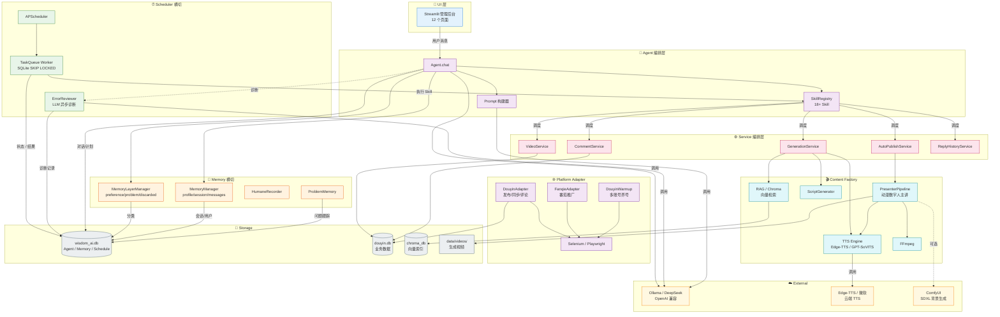

# 系统架构

四层架构 + 横切关注点（Memory / Scheduler / LLM）。



## 关键模块

| 层 | 模块 | 职责 |
|---|---|---|
| UI | Streamlit | 12 个页面：看板 / 视频 / 评论 / 自动回复 / 规则 / 违禁词 / 知识库 / 用户 / 对话 / **我的记忆** / **任务调度** / 设置 |
| Agent | `Agent.chat()` | LLM 决策 + 计划生成 + 用户确认拦截 + 失败兜底 |
| Agent | `SkillRegistry` | 18+ Skill 统一注册：内容 / 平台 / 养号 / 番茄 / 知识库 / 记忆 / 系统 |
| Memory | `MemoryLayerManager` | 自动分类 preference/problem/discarded + 滑动窗口 + 问题去重 |
| Memory | `MemoryManager` | 用户画像 + 会话/消息 + 待确认计划持久化 |
| Scheduler | `APScheduler` | cron / interval 触发 → 入队 |
| Scheduler | `TaskQueue` | 后台 Worker 抢任务 → 调 Skill → 重试 / 错误诊断 |
| Service | `GenerationService` | 脚本 / TTS / BGM 编排 |
| Service | `AutoPublishService` | 一键生成并发布 |
| Factory | `PresenterPipeline` | 动漫数字人主讲：Edge-TTS + Sonic + ComfyUI + FFmpeg |
| Platform | `DouyinAdapter` | Selenium 浏览器自动化：发布 / 同步 / 评论 / 回复 |
| Platform | `DouyinWarmup` | 多账号养号：随机观看 + 评论区浏览 + 可控点赞 |
| Platform | `FanqieAdapter` | 番茄小说推广 MVP |

## 数据流

```
用户消息
  ↓
Memory 分层入库 (preference / problem / normal)
  ↓
Agent 加载上下文
  ↓
LLM 决策
  ↓
Skill 执行（写操作前先确认）
  ↓
结果 → 写入视频文件 + DB
  ↓
异常 → ProblemMemory + ErrorReview (LLM 自动诊断)
```
