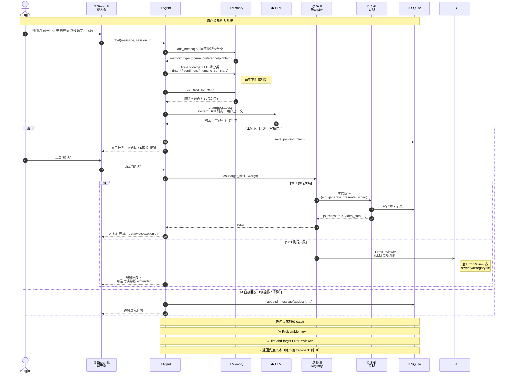

# 端到端工作流

用户输入一条消息，到最终结果展示的完整路径。包含正常路径和异常路径。



## 关键设计

- **写操作必须确认**：发布 / 生成视频 / 自动回复 / 养号 等需要 `requires_confirmation=True`，LLM 输出 `​```plan ```​` 块，用户回复"确认"才执行
- **LLM 分类异步化**：同步快路径用关键词规则拿 `memory_type`（不阻塞），后台 enrich 拿 `intent` / `sentiment` / `humane_summary`
- **错误全兜底**：Agent 任何异常被 `_handle_chat_failure` 拦截 → ProblemMemory + ErrorReviewer，UI 永远拿到兜底文本
- **计划持久化**：pending plan 存 SQLite，刷新页面 / 重启不丢，下次能续上"确认"
